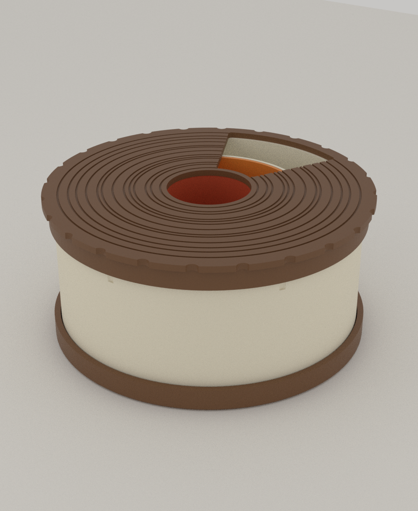
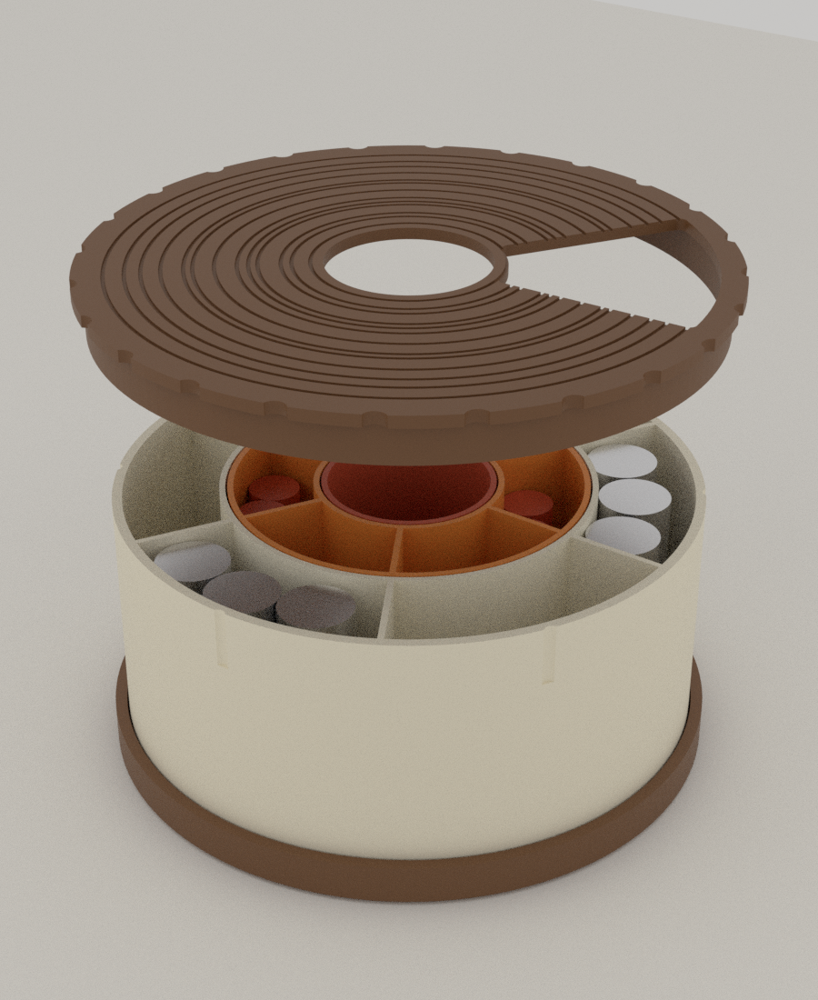
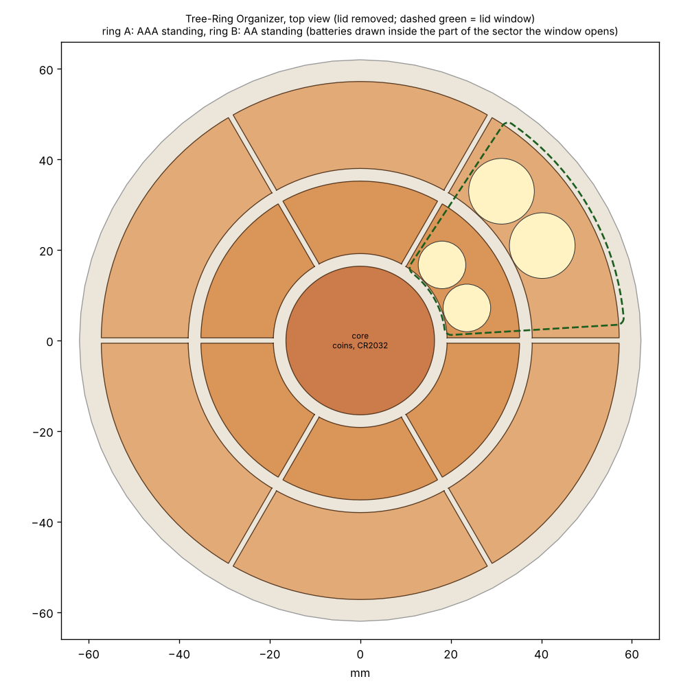

# 01 · Tree-Ring Rotary Organizer (나이테 회전 정리함)

Autumn Nest 공모전 **Autumn Storage** 출품작. 나무 줄기를 단면으로 자른 모양의 원형 정리함입니다. 속에 **세 겹의 고리(중심 + 나이테 2겹)** 가 끼워져 있고, 윗면의 **회전 뚜껑에 창이 하나** 뚫려 있어서 한 번에 한 칸씩만 열립니다. 뚜껑 윗면에는 나이테가 새겨져 있습니다.

 

*(Blender 렌더. 오른쪽은 뚜껑을 들어 올리고 AAA/AA 건전지를 넣어 본 모습. 렌더 색은 예시입니다.)*

## 어떻게 쓰는가

| 부분 | 칸 | 넣는 것 |
|---|---|---|
| 중심 (core) | 1칸, 지름 32.8mm, 44mL | 동전, CR2032, 클립 등(AAA 7개 또는 AA 3개를 세울 수도 있음). **뚜껑 가운데 구멍으로 항상 열려 있음** |
| 안쪽 고리 (ring A) | 6칸, 칸당 23mL | **AAA 건전지를 세워서** 칸당 2개 |
| 바깥 고리 (ring B) | 6칸, 칸당 49mL | **AA 건전지를 세워서** 칸당 3개 |
| 뚜껑 | 창 53° 하나 | 안쪽 고리 한 칸과 바깥 고리 한 칸이 **같은 방향으로 함께** 열림 |

뚜껑을 돌리면 6개 위치(60° 간격)에서 걸리는 느낌으로 멈춥니다. 건전지 말고도 나사, 구슬, 단추, 핀 같은 작은 물건 정리에 쓰면 됩니다. 총 용량은 약 **476mL**(중심 44 + 안쪽 138 + 바깥 294).

고리 3개는 **따로 출력되는 별도 부품**이라서 하나만 빼서 작업대로 들고 갈 수 있습니다(예: 나사 칸이 있는 안쪽 고리). 뚜껑은 별도의 핀이나 나사 없이 **바깥 고리 윗부분을 감싸며 돕니다.** 추가 부품(볼트, 자석, 스프링)은 필요 없습니다.



*(위에서 본 칸 구성. 점선은 뚜껑 창, 원은 창으로 꺼낼 수 있는 건전지입니다. 실제 메쉬를 잘라서 그렸습니다.)*

## 구조

| 파일 | 설명 |
|---|---|
| `stl/base.stl` | 받침. 지름 124mm × 9mm. 바깥 고리가 들어가는 낮은 턱이 있음 |
| `stl/ring_b.stl` | 바깥 고리. 지름 118 × 높이 54mm. 6칸. 윗부분 바깥에 홈 6개(걸림용). 바깥 벽만 2.0mm, 나머지 1.2mm |
| `stl/ring_a.stl` | 안쪽 고리. 지름 73 × 54mm. 6칸 |
| `stl/core.stl` | 중심 컵. 지름 35 × 54mm |
| `stl/lid.stl` | 뚜껑. **판을 바닥에 두고 치마가 위로 가는 출력 방향.** 지름 127mm. 지름 32mm 가운데 구멍, 53° 창, 나이테 새김, 가장자리 손잡이 홈 24개, 치마 안쪽에 걸림 리브 3개 |
| `asm/*.stl` | 같은 부품을 조립 위치에 놓은 것 (검사와 렌더용, 출력 안 함) |
| `tree_ring_organizer.scad` | 소스. `asm_parts=true`로 조립 위치, `k_window`로 창 위치 |
| `plate_256_1.3mf`, `plate_256_2.3mf` | 256×256 베드에 전부 배치 (2장: 4개 + 1개) |
| `bed180_*.3mf` | **색상별 베드**, 180×180로 충분: 갈색 2장(뚜껑, 받침), 크림(바깥 고리), 주황(안쪽 고리), 빨강(중심 컵) |
| `check.txt` | 검증 로그 |

모든 부품이 한 장에 안 올라가는 이유: 받침과 뚜껑이 지름 124~127mm라서 256mm 베드에는 한 장에 하나씩밖에 안 들어갑니다. 고리를 서로 안에 넣은 상태로 출력하는 방법은 간극이 0.4mm뿐이라 권하지 않습니다.

### 나이테 무늬

뚜껑의 홈은 폭이 1.4~4.6mm 사이에서 무작위로 바뀌는 열세 개의 고리입니다(넓은 고리 = 좋은 해, 좁은 고리 = 가문 해). `ring_seed`를 바꾸면 무늬가 달라져서 같은 정리함을 여러 개 만들어도 서로 다릅니다. 홈은 깊이 0.5mm, 폭 0.8mm입니다. 출력할 때 뚜껑 윗면이 베드에 닿으므로 매끈한 바닥 위에 홈이 새겨진 면이 됩니다.

### 걸림(디텐트)

뚜껑 치마 안쪽에 **세로 리브 3개**(120° 간격)가 있고, 바깥 고리 윗부분에 **세로 홈 6개**(60° 간격)가 있습니다. 리브가 홈에 들어가면 창이 칸의 한가운데에 서고, 홈 사이에서는 리브가 바깥 고리 벽을 0.35mm 누릅니다. 그래서 위치 사이로 돌릴 때만 약간 뻑뻑하고 홈에 들어가면 살짝 걸립니다.

## 검증한 것 (`tools/organizer_check.py`, 로그는 `check.txt`)

| 항목 | 결과 |
|---|---|
| 5개 부품 모두 단일 몸체, 수밀 | 통과 |
| 오버행 | 고리 3개 0, 받침 4mm²(바닥 45° 모따기), 뚜껑 2083mm²(나이테 홈의 천장: 폭 0.8mm 브리지, 깊이 0.5mm) |
| 끼워 맞춤 간극(메쉬에서 측정) | 중심↔안쪽 고리 0.40, 안쪽↔바깥 고리 0.40, 바깥 고리↔받침 턱 0.40, 뚜껑 치마↔바깥 고리 0.40mm |
| 뚜껑이 세 고리 위에 앉는가 | 세 고리 윗면이 모두 57.00mm, 뚜껑 판 아랫면도 57.00mm |
| 창 위치 6곳 × (안쪽 6칸, 바깥 6칸) | 위치마다 **정확히 한 칸만** 열림(93~97%). 나머지 칸은 0% |
| 창을 위치 사이(30°)에 두면 | 인접한 두 칸이 반씩(42~46%) 열림. 칸 사이 칸막이에 걸림 |
| 가운데 구멍 | 중심 컵이 100% 열림 |
| 걸림 | 홈에 있을 때 리브 끝이 홈 바닥에서 0.35mm 떨어짐, 홈 사이에서는 0.35mm 누름 |
| 용량(단면 적분) | 중심 44mL, 안쪽 6칸 각 23mL, 바깥 6칸 각 49mL (칸 크기 편차 0%) |
| 건전지 | 안쪽 고리 칸에 AAA 2개(세움), 바깥 고리 칸에 AA 3개(세움). 높이 여유 52.4mm > 50.5mm. 뚜껑 창을 통해 모두 꺼낼 수 있음(창 아래 영역에서 같은 수가 들어감) |
| 전체 무게 | 속이 찬 PLA로 계산하면 226g. 인필을 쓰면 이보다 적음 (실제 무게는 안 쟀음) |

## 출력 권장

- PLA, 노즐 0.4mm, 레이어 0.2mm. 서포트 필요 없음.
- **고리 3개**: 외벽 3개(1.2mm). 바깥 고리의 바깥 벽만 5개(2.0mm). 인필은 칸 안이 비어 있어서 거의 의미 없음. 높이가 54mm라 윗부분이 흔들리면 속도를 낮추세요.
- **뚜껑**: 판이 베드에 닿는 방향 그대로. 큰 평판이므로 베드 접착과 휨에 주의(브림 또는 베드 온도 높이기). 창이 있어서 C자 모양이라 한쪽으로 휠 수 있습니다.
- **받침**: 평판이라 휨 주의. 아랫면은 1mm 모따기.
- 끼워 맞춤 간극은 0.4mm입니다. 프린터가 정확하지 않아 너무 뻑뻑하거나 헐거우면 `gap`을 0.3~0.5mm로 바꿔서 다시 만드세요. 뚜껑과 바깥 고리 사이 간극은 `skirt_ri`가 `rb_ro + gap`이라서 같이 바뀝니다.

## 아직 확인하지 못한 것

- **실제 출력.** 간극 0.4mm가 당신의 프린터에서 맞는지, 높이 54mm의 1.2mm 벽이 출력 중에 흔들리지 않는지, 큰 뚜껑이 휘지 않는지.
- **걸림의 느낌.** 0.35mm 누름이 실제 PLA에서 어느 정도의 클릭인지는 메쉬로 알 수 없습니다. 너무 약하거나 강하면 `rib_out` 값을 바꾸세요(0.2~0.5mm).
- **정리함을 통째로 들 때.** 뚜껑은 고리 위에 얹혀 있을 뿐 고정되지 않아서, 옆을 잡고 들면 뚜껑이 빠질 수 있습니다. 밑받침을 받쳐 들어야 합니다.
- 건전지 개수는 원을 단순 배치한 하한 값(실제 건전지 직경 10.5, 14.5mm 기준)입니다. 실제 제품은 약간 다를 수 있습니다.

## 다시 만들기

```bash
cd autumn-nest/01-tree-ring-organizer
for p in base ring_b ring_a core lid; do
  openscad -o stl/$p.stl -D "part=\"$p\"" tree_ring_organizer.scad
  openscad -o asm/$p.stl -D "part=\"$p\"" -D asm_parts=true tree_ring_organizer.scad
done
cd .. && python tools/organizer_check.py 01-tree-ring-organizer --plan 01-tree-ring-organizer/plan.png
```

링 높이 `ring_h`, 칸 수 `sectors`, 창 각도 `win_angle`, 간극 `gap`을 바꿀 수 있습니다. 칸 수를 바꾸면 `win_angle`도 `360/sectors`보다 5~7° 작게 맞추세요.
