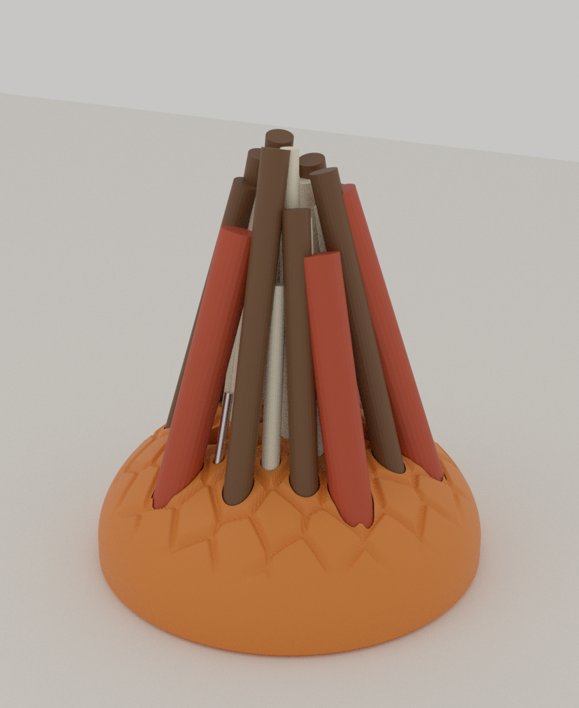
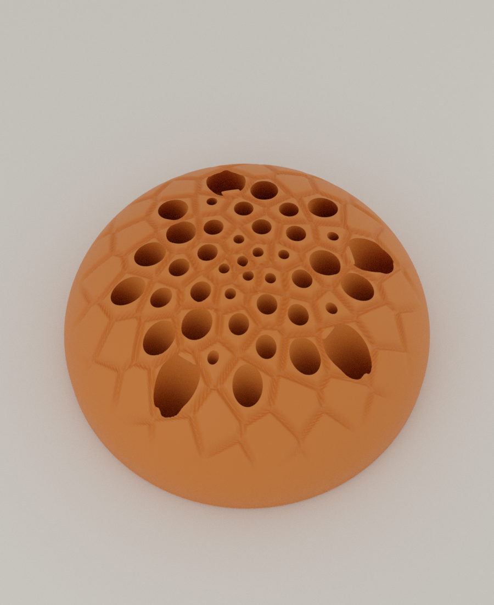
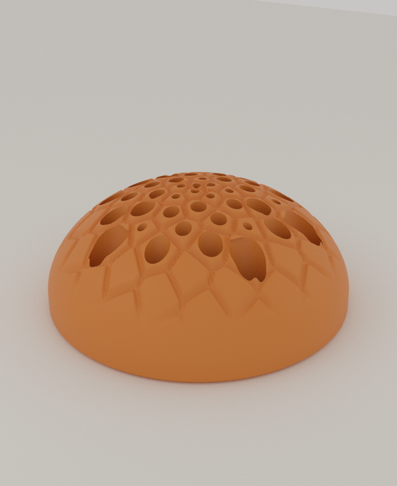
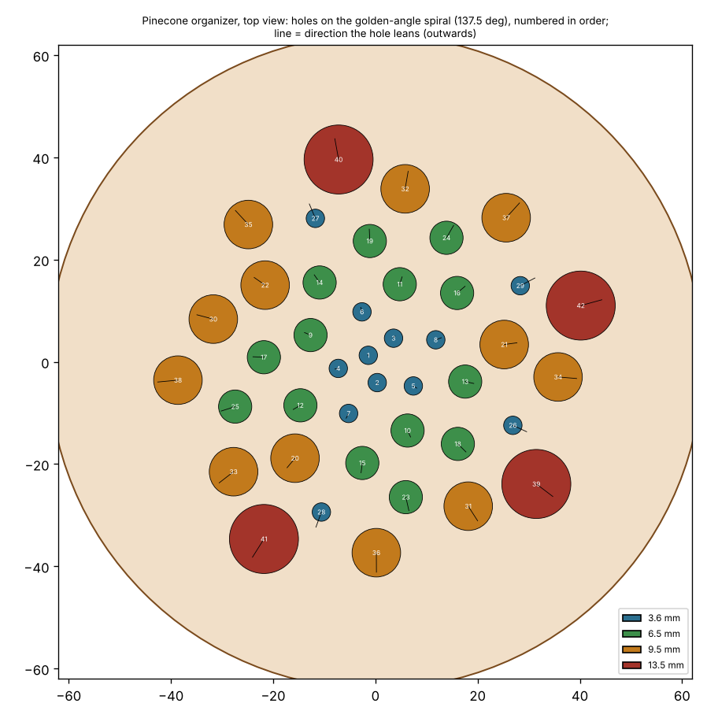
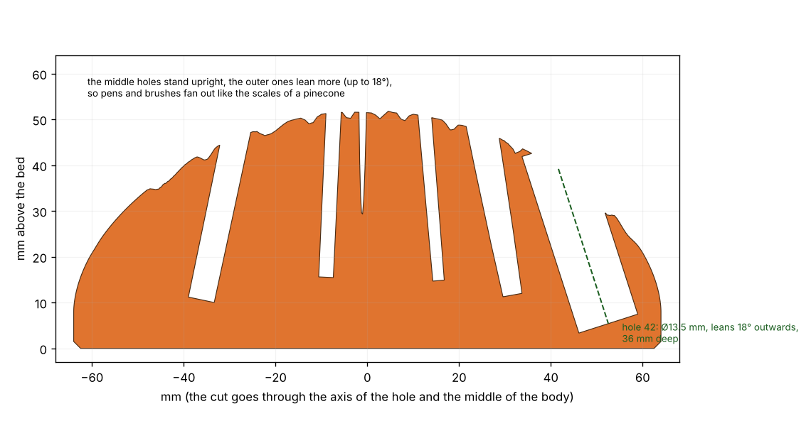

# 02 · Pinecone Organizer (솔방울 황금각 정리대)

Autumn Nest 공모전 **Autumn Storage** 출품작. 솔방울의 비늘이 **황금각(137.5°)** 나선으로 배열되는 것을 그대로 가져온 책상용 정리대입니다. 구멍마다 비늘 하나가 있고, 구멍은 중심에서 바깥으로 갈수록 **더 크고 더 많이 기울어서** 펜, 연필, 붓이 솔방울처럼 부채꼴로 펼쳐집니다.



 

*(Blender 렌더. 꽂힌 펜과 붓은 크기를 보여 주려는 임시 물체입니다.)*

## 어떻게 만들어지는가

| 특징 | 설명 |
|---|---|
| **황금각 나선** | 구멍 k번의 각도 = k × 137.5078°, 반지름 = 42mm × ((k−0.5)/42)^0.7. 해바라기와 솔방울에서 비늘이 서로 가리지 않으면서 가장 빽빽하게 놓이는 바로 그 배열입니다. 검사에서 인접한 구멍의 각도 차이가 137.5078°로 정확히 맞음을 확인했습니다. |
| **구멍 4종** | 안쪽(가운데)에는 가는 구멍, 바깥에는 굵은 구멍을 놓습니다. 구멍 Ø3.6 (12개), Ø6.5 (14개), Ø9.5 (12개), Ø13.5 (4개), 총 **42개**. 구멍 크기는 이웃 구멍과의 벽이 2mm 이상이 되도록 배치 프로그램이 결정했습니다. |
| **부채꼴로 기울어진 구멍** | 가운데 구멍은 거의 수직이고 바깥쪽 구멍은 최대 18° 바깥으로 기웁니다. 깊이는 모두 36mm. |
| **비늘 무늬** | 표면은 구멍 중심들의 파워 다이어그램(가중 보로노이)으로 나눈 비늘이고, 비늘 사이는 깊이 1.8mm의 둥근 홈입니다. 구멍이 없는 바깥 비늘은 가상의 중심(ghost)으로 이어서 돔 전체를 덮습니다. |
| **서포트 없음** | 바깥면은 **높이 함수(height field)** 라서 구조상 오버행이 없고, 기울어진 구멍은 45°보다 훨씬 덜 눕고, 구멍 바닥은 위를 향합니다. 바닥을 베드에 놓고 그대로 출력합니다. |



*(위에서 본 구멍 배치. 번호 = 나선 순서, 선 = 구멍이 기우는 방향.)*



*(가운데와 가장 많이 기운 구멍을 지나는 단면. 실제 STL을 잘라 그렸습니다.)*

## 구멍 크기와 용도

| 구멍 | 개수 | 용도 (일반적인 물건의 크기이고 직접 재지는 않았습니다) |
|---|---|---|
| Ø3.6mm | 12 | 바늘, 핀, 귀걸이 침, 머리핀, SIM 핀 (Ø3.2 이하) |
| Ø6.5mm | 14 | 가는 펜, 샤프, 가는 붓, 핀셋 (Ø6 이하) |
| Ø9.5mm | 12 | 연필(둥근 7.2mm, 육각 모서리 폭 8.7mm), 볼펜, 사인펜, 드라이버 (Ø9 이하) |
| Ø13.5mm | 4 | 굵은 마커, 형광펜, 큰 붓 (Ø13 이하) |

## 파일

| 파일 | 설명 |
|---|---|
| `stl/pinecone.stl` | 정리대. 지름 128 × 높이 52mm, 약 7.6만 면 |
| `holes.json` | 구멍 표(번호, 위치, 지름, 기울기, 깊이, 축 방향). 검사와 렌더가 읽습니다 |
| `plate_256.3mf`, `bed180_orange.3mf` | 256 베드와 180 베드 배치(한 개) |
| `check.txt` | 검증 로그 |

생성기는 `tools/pinecone_organizer.py`입니다(numpy로 돔 메쉬를 만들고 Blender Manifold 불리언으로 42개 구멍을 한 번에 뚫습니다).

## 출력 권장

- PLA, 노즐 0.4mm, 레이어 0.2mm. **서포트 필요 없음.** 바닥이 베드에 닿습니다.
- 구멍마다 외벽 3개 정도가 생기므로 인필은 10~15%면 충분합니다. 속이 찬 PLA로 계산하면 469g이지만 인필을 쓰면 훨씬 줄어듭니다(실제 무게는 안 쟀습니다).
- 비늘 사이 홈은 깊이 1.8mm라 레이어가 눈에 띄게 계단으로 보일 수 있습니다. 레이어 높이를 낮추면 더 매끈합니다.
- 구멍 크기가 안 맞으면 `tools/pinecone_organizer.py`의 `SIZES`를 바꿔서 다시 만드세요(예: 연필이 뻑뻑하면 9.5 → 10).

## 검증한 것 (`tools/pinecone_check.py`, 로그는 `check.txt`)

| 항목 | 결과 |
|---|---|
| 단일 몸체, 수밀 | 통과 |
| 오버행 | 42mm²(전체의 0.06%). 구멍이 비늘 사이의 홈을 지나갈 때 생기는 아주 작은 조각이고 그 밖에는 없음 |
| **42개 구멍이 모두 뚫려 있고 설계한 깊이인가** | 구멍마다 3개의 레이를 구멍 안에서 쏴서 확인: 42개 모두 통과, 깊이 오차 0.00mm |
| 제거된 부피 | 71.6cm³. 원기둥 42개의 부피 72.3cm³와 0.991배(구멍이 합쳐지거나 빠지지 않음) |
| 황금각 | 구멍 k+1은 구멍 k보다 137.5078° 돈 위치 (오차 0.0000°) |
| 구멍끼리의 벽 | 구멍 축을 따라 전체 길이에서 최소 2.02mm (선 4줄 = 1.6mm 필요) |
| 구멍과 바깥면 사이의 벽 | 구멍 아래쪽 절반에서 최소 2.73mm. 구멍 바닥 가장자리는 표면에서 3.28mm 이상, 가장 낮은 곳이 베드에서 3.3mm 위 |
| 구멍 입구 | 기울어진 구멍은 돔의 경사면에서 긴 타원으로 열리고, 아래쪽 입술이 파인 홈(notch)이 됩니다. 펜이 기대어 눕는 자리가 됩니다. 샘플의 약 2%가 이 열린 부분이고, 끝에 칼날처럼 얇은 가장자리가 생깁니다(무해) |

## 아직 확인하지 못한 것

- **실제 출력.** 비늘 홈의 모양, 가장 굵은 구멍의 입구 모양, 인필을 쓴 무게와 출력 시간.
- **넘어짐.** 무겁고 긴 물건을 바깥쪽 구멍에 몇 개 꽂았을 때 정리대가 넘어지는지는 계산하지 않았습니다. 지름 128mm의 넓은 바닥에 52mm 높이라 안정적일 것으로 보이지만 검증한 것은 아닙니다.
- 구멍에 들어가는 물건의 실제 크기(위 표의 크기는 일반적인 값).

## 다시 만들기

```bash
cd autumn-nest
python tools/pinecone_organizer.py 02-pinecone-organizer/stl/pinecone.stl --holes 02-pinecone-organizer/holes.json
python tools/pinecone_check.py 02-pinecone-organizer --plan 02-pinecone-organizer/plan.png --section 02-pinecone-organizer/section.png
```

`tools/pinecone_organizer.py`의 `R`, `H_DOME`, `Q_DOME`(1에 가까울수록 원뿔), `R_HOLES`, `N_HOLES`, `TILT_MAX`, `SIZES`, `WANT`로 크기, 모양, 구멍 구성을 바꿀 수 있습니다. 바꾼 뒤에는 `pinecone_check.py`로 깊이와 벽을 다시 확인하세요(구멍 깊이는 벽 두께 조건을 지키도록 자동으로 줄어듭니다).
