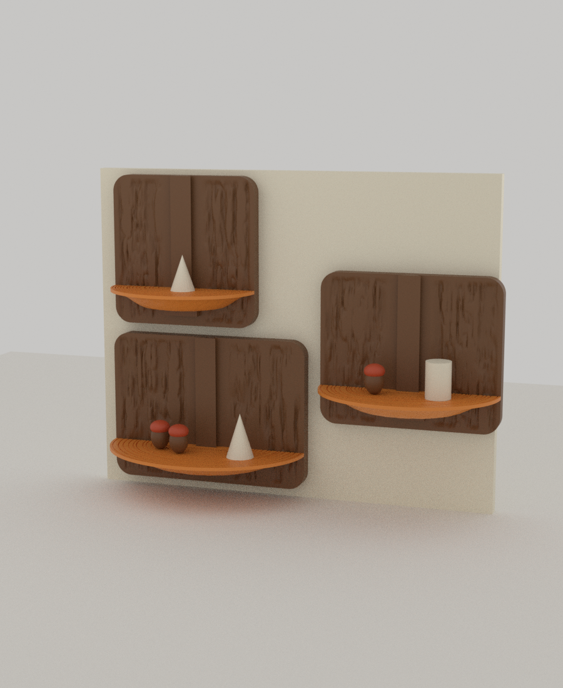

# 04 · Bracket Fungus Shelf (말굽버섯 전시 선반)

Autumn Nest 공모전 **Woodland Displays** 출품작. 나무 줄기에 붙어 자라는 **말굽버섯(bracket fungus)** 모양의 벽걸이 전시 선반입니다. 반원형 선반이 **나무껍질 판**에 위에서 미끄러져 들어가 끼워지고, 윗면에는 버섯 같은 **나이테 무늬**가 새겨져 있습니다. 소형, 중형, 대형 3종이라 나무에 버섯이 여러 단으로 자라듯 어긋나게 걸 수 있습니다.



*(Blender 렌더. 도토리, 솔방울, 컵은 크기를 보여 주려는 임시 물체입니다.)*

## 어떻게 만들어지는가

| 특징 | 설명 |
|---|---|
| **서포트 없이 출력** | 선반은 **평평한 윗면(전시면)을 베드에 대고 뒤집어서** 출력합니다. 말굽처럼 두꺼운 아랫면이 위를 보므로 오버행이 없습니다. 껍질 판은 뒷면을 베드에 댑니다. |
| **위에서 끼우는 도브테일** | 껍질 판의 세로 레일(폭 8 → 16mm, 높이 4mm, 45° 옆면)에 선반 뒷면의 도브테일 홈이 끼워집니다. 선반은 판 윗변에서 레일을 따라 내려와 **받침 블록**에 앉습니다. 나사나 접착제는 없습니다. |
| **뒤집어 출력해도 홈이 정확** | 홈은 선반 두께를 관통하는 2D 단면을 쭉 뽑은 모양이라 출력 방향(위아래)으로 모든 층이 같습니다. 오버행이 없고 치수가 정확합니다. |
| **껍질은 파인 무늬** | 나무껍질의 골은 평평한 앞면보다 **아래로 파여 있습니다**(깊이 2.4mm). 선반 뒷면이 평평하게 미끄러져 지나가야 해서 불룩한 무늬를 쓰지 않았습니다. 시드로 모양이 달라집니다. |
| **나이테 홈** | 선반 윗면에 같은 비율의 반타원 나이테 홈 14개(폭 0.8mm, 깊이 0.5mm, 3개는 0.9mm). 간격은 시드로 만든 무작위 열입니다. |
| **명함 홈** | 뒷부분에 폭 2.4mm, 깊이 9mm의 홈이 있어서 작품 이름표, 가격표, 사진을 세울 수 있습니다. |
| **벽 걸이** | 껍질 판 뒷면에 **열쇠 구멍(keyhole) 2개**. 벽에 박은 나사 머리에 판을 끼워 아래로 밀면 걸립니다. |

## 크기

| | 선반 | 껍질 판 | 전시면 | 지름이 들어가는 원 | 명함 홈 | 열쇠 구멍 간격 |
|---|---|---|---|---|---|---|
| **L** | 150 × 62mm | 150 × 110mm | 7248mm² | 58mm | 70mm | 106mm |
| **M** | 130 × 54mm | 130 × 110mm | 5457mm² | 50mm | 60mm | 86mm |
| **S** | 110 × 46mm | 110 × 110mm | 3918mm² | 41mm | 51mm | 66mm |

선반 두께는 벽쪽 14mm, 가장자리 2.4mm입니다. 선반이 앉는 높이는 껍질 판 아래에서 14mm(받침 블록 윗면)이고, 그 위로 판이 약 82mm 올라가서 **배경 판** 역할을 합니다.

## 파일

| 파일 | 설명 |
|---|---|
| `stl/shelf_{L,M,S}.stl` | 선반 (출력 방향: 윗면이 베드, 약 11만 면) |
| `stl/plaque_{L,M,S}.stl` | 껍질 판 (출력 방향: 뒷면이 베드, 레일과 받침 블록 포함) |
| `plate_256_1.3mf`, `plate_256_2.3mf` | 256×256 베드 2장에 전부 배치 (4개 + 2개) |
| `bed180_orange_*.3mf`, `bed180_brown_*.3mf` | **색상별 베드**(180×180): 선반 = 주황 2장, 껍질 판 = 갈색 3장 |
| `preview_set.png`, `preview_slide.png`, `rings.png` | 렌더, 선반을 끼우는 모습, 선반 윗면의 나이테 |
| `check.txt` | 검증 로그 |

생성기는 `tools/bracket_fungus.py`입니다(numpy로 메쉬를 만들고 Blender Manifold 불리언으로 홈, 레일, 열쇠 구멍을 파고 붙임).

## 조립과 걸기

1. 벽에 나사 2개를 박습니다. 간격은 위 표의 열쇠 구멍 간격이고, 머리 지름 7~9mm, 머리 두께 3.5mm 이하, 몸통 지름 4.2mm 이하입니다. 머리가 벽에서 약 4mm 떠 있도록 박으세요. 무거운 물건을 올릴 거면 벽 앵커를 쓰세요.
2. 껍질 판을 벽에 걸고 아래로 밉니다(열쇠 구멍 홈이 11mm 길이입니다).
3. 선반을 **판 윗변 위에서 레일에 맞춰** 내려놓습니다. 레일 홈이 열려 있는 방향이 위쪽입니다. 받침 블록에 앉으면 끝입니다.
4. 서랍처럼 위로 빼면 분리됩니다. 선반은 중력으로 눌려 있고 잠금 장치는 없으므로, 걸린 채로 세게 위로 치지 마세요.

판 바로 위에 다른 판이 있으면 선반이 들어갈 틈이 없으므로, **선반을 판에 먼저 끼운 다음** 판을 거세요.

## 검증한 것 (`tools/shelf_check.py`, 로그는 `check.txt`)

| 항목 | 결과 |
|---|---|
| 6개 부품 모두 단일 몸체, 수밀 | 통과 |
| 오버행 | 선반 1340~1715mm²(나이테 홈의 천장 0.8mm 브리지와 명함 홈 천장 2.4mm 브리지), 껍질 판 300mm²(열쇠 구멍 천장, 폭 9.6mm 브리지). 그 밖에는 없음 |
| **슬라이드 경로** | 판 윗변에서 받침까지 40개 높이로 단면을 비교: 선반과 레일의 겹침 0.000mm², 최소 간극 0.30mm (3종 모두) |
| **받침 블록** | 윗면 14.00mm = 선반 아랫면 14.00mm. 접촉 면적 125mm²(10N 하중에서 0.08MPa) |
| 열쇠 구멍 | 2개, 머리가 통과하는 원 Ø9.5mm, 몸통 홈 4.6mm, 머리 주머니 원 Ø10.5mm와 홈 폭 9.6mm. 위치가 좌우 대칭 |
| 나이테, 명함 홈 | 14개의 홈과 명함 홈, 도브테일 홈이 윗면을 20~22개의 띠로 나눔. 명함 홈 70/60/51 × 2.4mm |
| 하중 추정 | 1kg을 깊이 70% 위치에 올렸을 때 도브테일 옆면이 받는 힘은 23~30N(0.14~0.19MPa). **가정한 PLA 값으로 계산한 추정이며 실제로 재지 않았습니다.** 도브테일보다 벽 나사가 약점입니다. |

## 출력 권장

- PLA, 노즐 0.4mm, 레이어 0.2mm. 서포트 필요 없음.
- **선반**: 윗면이 베드에 닿는 방향 그대로. 나이테 홈이 베드 면에 있어서 첫 레이어가 번져 얕아질 수 있습니다. 홈이 흐려지면 `bracket_fungus.py`의 홈 폭, 깊이를 늘리세요. 아랫면(위쪽)에 약한 구멍 무늬가 있습니다.
- **껍질 판**: 뒷면이 베드. 넓은 평판이라 휨에 주의(브림, 베드 온도). 레일 옆면은 45°라 서포트 없이 가능한 한계 각도입니다.
- 레일과 홈의 간극은 0.3mm입니다. 너무 뻑뻑하면 `CLR`을 0.4~0.5mm로 올려서 다시 만드세요(`tools/bracket_fungus.py`).
- 무게는 속이 찬 PLA 기준 선반 40~75g, 껍질 판 145~195g입니다. 인필을 쓰면 줄어듭니다.

## 아직 확인하지 못한 것

- **실제 출력과 끼워 맞춤.** 0.3mm 간극이 당신의 프린터에서 맞는지.
- **하중.** 위 추정은 가정에 기반한 계산이고 시험하지 않았습니다. 벽 나사와 벽 재질이 실제 한계를 정합니다.
- **열쇠 구멍 천장 브리지(폭 9.6mm)** 가 처지는지.
- 렌더의 도토리, 솔방울, 컵은 임시 물체이고 실제 전시물의 무게나 크기와는 무관합니다.

## 다시 만들기

```bash
cd autumn-nest
for s in L M S; do
  python tools/bracket_fungus.py shelf  04-fungus-shelf/stl/shelf_$s.stl  --size $s
  python tools/bracket_fungus.py plaque 04-fungus-shelf/stl/plaque_$s.stl --size $s
done
python tools/shelf_check.py 04-fungus-shelf --plan 04-fungus-shelf/rings.png
```

`SIZES`에서 반지름, 깊이, 시드를 바꾸면 다른 크기와 무늬가 나옵니다.
