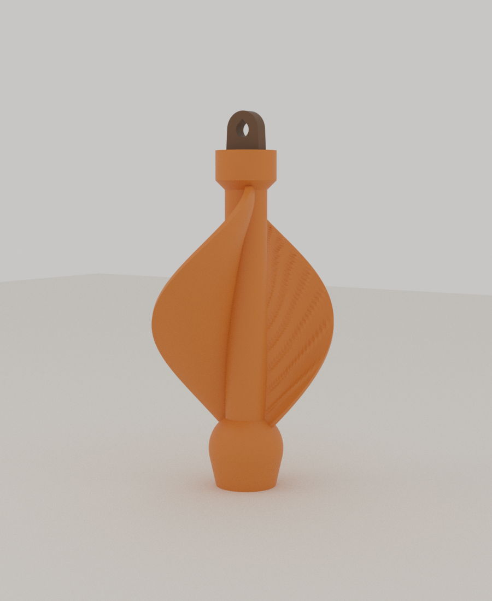
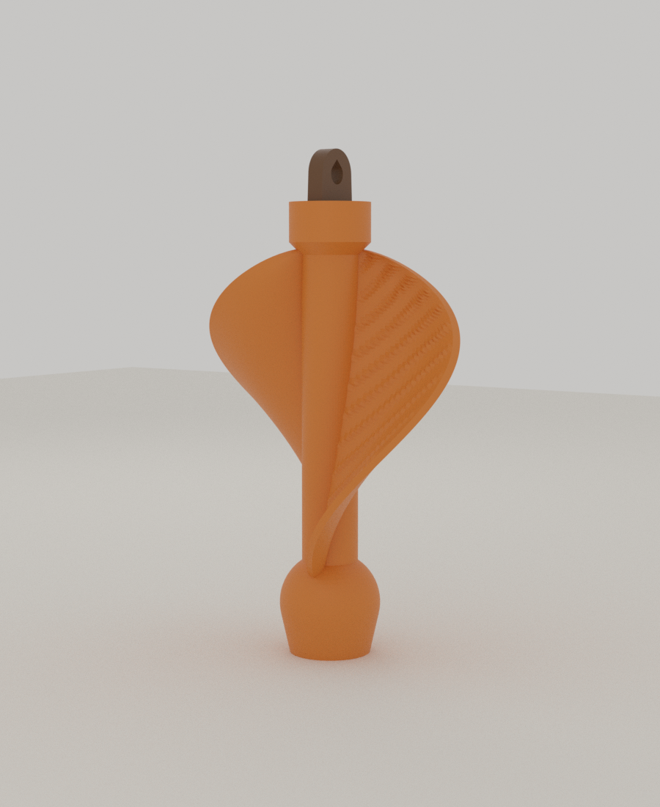

# 05 · Samara Twister (단풍 시과 트위스터)

Autumn Nest 공모전 **Autumn in Motion** 출품작. 단풍나무 씨앗(시과, samara)을 본뜬 **무음 키네틱 행잉 장식**입니다.
밤톨 모양 허브, 가는 척추, 비틀리고 오목하게 휜 두 장의 날개(잎맥 리브 포함)로 이루어지고, 회전축은 **조립 없이 한 번에 출력되는 print-in-place 원뿔 스위블**입니다.

 

## 왜 이 구조인가 (설계 판단)

처음 구상은 "수평 날개가 돈다"였지만 물리적으로 맞지 않아 바꿨습니다.

- 실제 단풍 씨앗은 **수직 기류**(낙하, 상승기류)에서 회전합니다. 수평으로 뻗은 날개는 수평 바람을 모서리로 받아 거의 돌지 않습니다.
- 매달린 장식은 주로 **수평 바람**을 받으므로, 날개를 **세로로 세우고 나선형으로 비틀어** Savonius형 풍차(오목한 날개가 한쪽 방향 바람을 더 많이 받는 구조)로 만들었습니다. 나선 비틀림은 시동이 잘 걸리고 토크가 고르게 하는 역할을 합니다.
- 줄에 매달려 도는 장식은 줄이 꼬이기 쉬워서, 줄이 아닌 **스위블**이 돌게 했습니다.
- 잎맥 리브는 **위를 향한 날개 면**에만 붙입니다. 아래를 향한 면에 붙이면 리브 옆면이 오버행이 됩니다(검증 중 발견, 69mm² → 6mm²로 감소).

## 구성

| 파트 | 설명 |
|---|---|
| 회전체 | 밤톨 허브 + 척추 + 날개 2장. 스위블 주위로 자유롭게 회전 |
| 샤프트 | 지름 4mm 축, 아래 원뿔 플랜지, 위 원뿔 머리, 줄 고리(별색 가능). 회전체와 0.4mm 간극으로 분리되어 같이 출력됨 |

원뿔 면은 모두 45°라 서포트가 필요 없습니다. 가운데 구멍은 헐겁게 뚫어 양 끝 9mm만 가이드로 쓰므로 실 끌림과 마찰이 적습니다.

## 검증 결과 (이 컨테이너에서 측정)

기본값 `stl/samara_twister.stl` 기준입니다. `tools/check_mesh.py`로 확인했습니다.

| 항목 | 결과 |
|---|---|
| 몸체 | 2개(회전체, 샤프트), 모두 수밀(watertight) |
| 가동부 간극 | 0.400mm (융착 위험 없음) |
| 서포트 필요 오버행 | 전체 면적의 0.06% (46.5° 초과 6.1mm²) |
| 크기 | 높이 89mm, 날개 바깥 지름 약 52mm |
| 회전체 부피 | 9.6cm³ (PLA 솔리드 기준 약 12g, 실제 출력은 더 가벼울 것으로 추정) |
| 변형 4종(날개 3장, 큰 것, 작은 것, 반대 비틀림) | 모두 수밀, 간극 0.4mm 유지 |

**아직 검증하지 못한 것**: 실제 출력, 스위블이 걸리지 않고 도는지, 실제 바람에서 얼마나 잘 도는지. 프린터와 풍동이 없으므로 아래 테스트 계획으로 확인해야 합니다. "약한 바람에 돈다"는 아직 목표이지 측정값이 아닙니다.

## 만드는 법

OpenSCAD 2021.01의 CGAL 백엔드는 날개와 허브의 합집합이 수 분 이상 걸립니다. 그래서 파트별로 내보내고 합치는 단계는 Blender(Manifold 불리언, 약 1초)에서 합니다. Manifold 백엔드가 있는 최신 OpenSCAD 스냅샷이라면 `part="spinner"` 한 번으로도 될 수 있지만, 이 환경에서는 최신 버전을 받을 수 없어 확인하지 못했습니다.

```bash
openscad -D 'part="hub"'   -o hub.stl   samara_twister.scad     # 허브 + 샤프트
openscad -D 'part="blade"' -o blade.stl samara_twister.scad     # 날개 1장
blender -b -P ../tools/blender_assemble.py -- hub.stl blade.stl 2 spinner.stl   # 날개 수 = blades 값
python3 ../tools/check_mesh.py spinner.stl                      # 수밀, 간극, 오버행 확인
blender -b -P ../tools/blender_render.py -- spinner.stl preview.png 35 64       # 렌더
```

`check_mesh.py`에는 `trimesh`, `numpy`, `scipy`, `networkx`가 필요하고, `pip install bpy`로 설치한 Python에서도 Blender 스크립트가 그대로 돌아갑니다.

## 출력 설정 (권장, 실제 출력 전이므로 시작점)

- 노즐 0.4mm, 레이어 0.2mm, 서포트 없음, PLA 또는 PETG
- 벽 4겹 이상(날개 두께 1.6mm), 인필 10~15%
- 바닥이 지름 14.4mm인데 높이가 89mm로 키가 큽니다. **브림 6~8mm**를 쓰고 외벽 속도를 낮추세요.
- 쿨링 최대. 출력 후 회전체를 손으로 가볍게 비틀어 스위블을 풀어 줍니다.

## 튜닝 (OpenSCAD Customizer 파라미터)

| 파라미터 | 올리면 | 주의 |
|---|---|---|
| `camber` (0.16) | 토크가 커짐(오목한 정도), 항력도 커짐 | 너무 크면 바람이 약할 때 오히려 무거워짐 |
| `twist` (130) | 토크가 고르고 시동이 쉬움 | `180 × 길이 ÷ (π × 바깥 반지름)`(약 130°)을 넘으면 날개 가장자리가 45°를 넘어 오버행 발생 |
| `blades` (2) | 날개 3장이면 시동이 더 쉬움, 단풍 열매 쌍 느낌은 2장 | 날개 수는 Blender 합치기 인자와 같아야 함 |
| `blade_width/height` | 크기 변화(축, 스위블은 그대로) | 세트로 만들 때 크기 3종 권장 |
| `clr` (0.4) | 스위블이 헐거워짐 | 먼저 `part="coupon"`으로 프린터에 맞는 값을 찾기 |
| `slice_dz` (0.5) | 낮추면 잎맥이 매끈함(0.25 권장) | 날개만 따로 내보내기 때문에 시간 부담이 적음 |

## 다음에 할 일 (테스트 계획)

1. `stl/swivel_coupon.stl`(18mm 높이)을 먼저 출력해 `clr` 0.3 / 0.4 / 0.5 중 걸림 없이 도는 값을 찾습니다.
2. 본 출력 후 선풍기 약풍(약 1~2m/s)을 정면에서 불어 회전 여부와 회전수를 기록합니다. 안 돌면 `camber`와 날개 3장을 먼저 시도합니다.
3. 제출용 자료: 회전 영상(10초), 사용 장면 사진, 이 README의 설계 근거, 출력 설정과 부품표(실 1개).
4. 크기를 3종(예: 폭 14 / 22 / 30mm)으로 만들고 가지 모양 행거에 높이를 달리해 매달면 모빌 연출이 됩니다.

## 파일

- `samara_twister.scad` 파라메트릭 모델 (Customizer 지원)
- `stl/samara_twister.stl` 기본값 완성본, `stl/swivel_coupon.stl` 스위블 시험편
- `preview_front.png`, `preview_side.png` Blender(Cycles) 렌더
