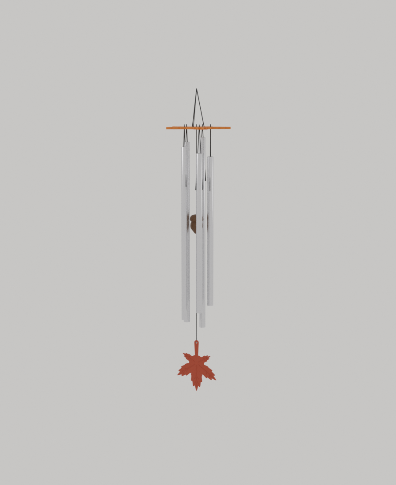
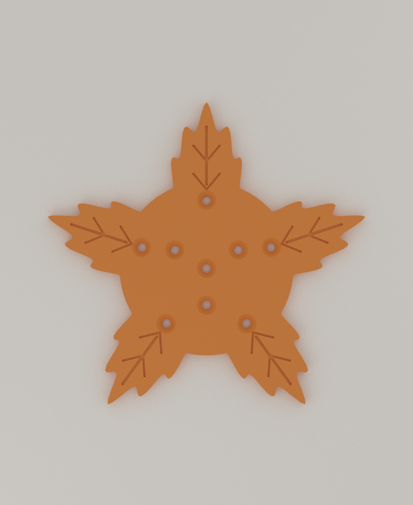
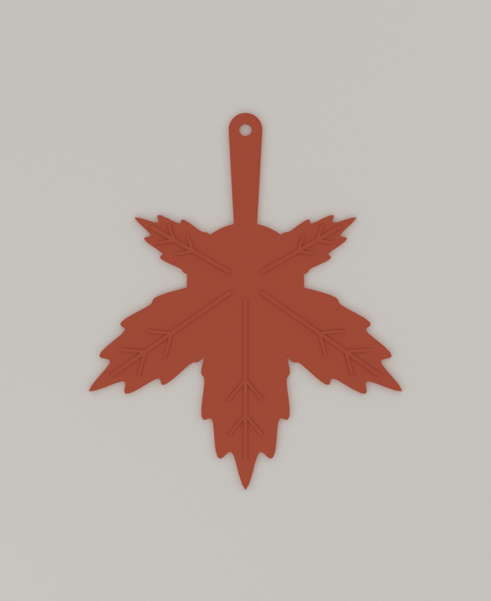

# 06 · Maple Chime (단풍 펜타토닉 윈드차임)

Autumn Nest 공모전 **Autumn in Motion** 출품작. 단풍잎 모양 캐노피에 **음정을 맞춘 알루미늄 튜브 5개**(도·레·미·솔·라, C 장조 펜타토닉)를 매달고, 도토리 타격추가 튜브를 치며, 아래의 **단풍잎 돛**이 바람을 받아 타격추를 흔듭니다.



| 캐노피 | 돛 |
|---|---|
|  |  |

## 설계 판단

- **베어링 없는 진자 구조.** 5번(회전 스피너)은 베어링 마찰이 풍력보다 커서 약한 바람에 못 돌 가능성이 높았습니다. 이번에는 타격추가 줄에 매달린 단순 진자라서 이길 마찰이 없고, 바람이 타격추를 `gap`(7mm)만 옆으로 밀면 튜브에 닿습니다.
- **튜브는 계산으로 음정을 맞춥니다.** 양 끝이 자유로운 보의 기본 진동수는 `f = (22.373 / 2π) · √(EI/ρA) / L²`이고, 길이를 이 식으로 구했습니다. 짧고 굵은 튜브는 전단과 회전 관성 때문에 음이 약간 낮아지므로, 유한요소(Timoshenko 보)로 보정한 길이도 함께 냈습니다(약 1mm 짧아짐).
- **튜브는 마디(node)에 매답니다.** 기본음의 진동 마디는 양 끝에서 22.4% 지점입니다. 이 점에 줄을 걸어야 튜브가 막히지 않고 오래 울립니다.
- **타격점은 위에서 42% 지점**으로 모든 튜브에 똑같이 맞췄습니다. 줄 길이(cord drop)가 튜브마다 다른 이유입니다.
- 캐노피는 5개 로브마다 튜브 구멍 1개이고, 서로 다른 단풍 2종(대칭 5엽 캐노피, 자연형 돛)입니다. 돛은 줄기 끝 구멍에 매달려 줄 위에서 자유롭게 돕니다.

## 부품

**출력물** (`stl/`)

| 파일 | 설명 | 출력 방향 | 서포트 |
|---|---|---|---|
| `canopy.stl` | 단풍 캐노피 121×115×4mm (구멍 9개 + 매듭용 카운터싱크, 잎맥 음각) | 평평하게 | 불필요 |
| `striker.stl` | 도토리 타격추 Ø26×36mm (축 구멍 Ø3.4) | 뾰족한 끝을 아래로 | 불필요(모든 경사 45° 이하) |
| `sail.stl` | 단풍잎 돛 83×100×1.6mm (잎맥 양각) | 평평하게, 잎맥이 위로 | 불필요 |
| `jig.stl` | 튜브 드릴 지그 36×28×22mm | 그대로 | 불필요 |

**구입 부품 (BOM)** (안내문이 요구한 사양)

| 부품 | 사양 | 수량 |
|---|---|---|
| 알루미늄 튜브 | 6063 또는 6061, **바깥지름 12mm × 두께 1.0mm** | 1.2m 2개 (또는 2m 1개) |
| 줄 | 편조 나일론 또는 폴리에스터 **Ø1.0mm** | 약 4m |
| 공구 | Ø3mm 드릴 날, 쇠톱 또는 파이프 커터, 줄, 연필, 튜닝 앱(스마트폰) | |

튜브 두께와 재질이 다르면 음정이 달라지므로 `python tools/chime_calc.py --od 10 --wall 1`처럼 규격을 넣어 표를 다시 뽑으세요(`maple_chime.scad`의 `tube_od`, `tube_wall`도 같이 바꿈).

## 튜브 절단표 (Ø12 × 1.0mm, 알루미늄 E=69GPa, ρ=2700)

`python tools/chime_calc.py`로 생성한 값입니다.

| 음 | Hz | 정확한 길이 | **절단 길이** | 윗단에서 구멍까지 | 캐노피 밑면에서 구멍까지(줄 길이) |
|---|---|---|---|---|---|
| C5 도 | 523.3 | 365.4 | **367.4** | 81.9 | 98.4 |
| D5 레 | 587.3 | 344.7 | **346.7** | 77.3 | 102.5 |
| E5 미 | 659.3 | 325.3 | **327.3** | 72.9 | 106.3 |
| G5 솔 | 784.0 | 298.0 | **300.0** | 66.8 | 111.6 |
| A5 라 | 880.0 | 281.1 | **283.1** | 63.0 | 114.9 |

(단위 mm. 절단 길이 = 정확한 길이 + 2mm 여유.)

## 조립

1. 튜브를 표대로 자르고 버(burr)를 줄로 다듬습니다.
2. 윗단에서 표의 거리를 재서 연필로 표시합니다. 지그(`jig.stl`)의 가운데 창에 표시를 맞추고 Ø3mm 드릴로 **양쪽 벽을 한 번에** 관통합니다.
3. 튜브 구멍에 줄을 꿰어 양 가닥이 튜브 옆(접선 방향)으로 올라가게 합니다. 이렇게 하면 타격추 쪽을 막지 않습니다.
4. 튜닝: 튜브를 구멍 줄로 들고 부드럽게 쳐서 스마트폰 튜닝 앱으로 확인하고, **아랫단만** 0.5mm씩 줄로 갈아 맞춥니다. 윗단은 그대로 둬서 구멍 위치를 유지합니다.
5. 캐노피 윗면의 해당 로브 구멍에 두 가닥을 꿰고 카운터싱크 안에서 매듭짓습니다. 캐노피 밑면에서 구멍까지의 줄 길이는 위 표를 따릅니다.
6. **타격추 줄**: 캐노피 가운데 구멍에 줄을 위에서 꿰어 매듭짓고, 도토리 위쪽 구멍으로 넣어 팁 쪽으로 빼 팁 아래에 매듭을 짓습니다. **타격추 테두리가 캐노피 밑면에서 170mm 아래**에 오도록 합니다(팁은 그보다 26mm 아래).
7. 같은 줄을 팁 매듭에서 약 212mm 더 내려 돛 줄기 구멍에 위에서 꿰고, **돛 줄기 구멍 아래**에 매듭을 지어 돛이 줄 위에서 돌게 합니다(구멍은 캐노피 밑면에서 408mm 아래).
8. 캐노피의 안쪽 구멍 3개(120° 간격)에 줄 3가닥을 꿰어 한곳에 모아 걸이 고리를 만듭니다.

## 검증 결과

이 컨테이너에서 직접 측정했습니다.

| 항목 | 결과 |
|---|---|
| 출력 부품 4종 | 모두 단일 몸체 수밀(watertight), 서포트가 필요한 오버행 0(지그만 Ø3.2 구멍 위쪽 5.6mm²) |
| 튜브 길이식 검증 | 4m 가느다란 튜브에서 유한요소 Timoshenko 모델이 교과서 값과 -0.004% 일치 |
| 조립 배치(STL 거리 측정) | 타격추-튜브 간극 **7.0mm**(설계값), 캐노피-튜브 16.1mm, 돛-튜브 28.7mm, 튜브-튜브 18.6mm, 타격점 5개 모두 **42.0%** |
| 무게 | 솔리드 기준 캐노피 약 29g, 타격추 15g(인필 포함 약 7g 추정), 돛 4.5g |
| 바람 추정 | 아래 표 |

### 바람 추정 (어림 계산, 시뮬레이션 아님)

돛 면적 29.6cm²(실측), 타격추 7g + 돛 4.5g, 평판 항력계수 1.2 가정. 타격추가 `gap`만큼 옆으로 밀리는 데 필요한 **정상풍** 속도입니다.

| gap | 4mm | **7mm(기본)** | 10mm |
|---|---|---|---|
| 필요 풍속 | 1.1m/s | **1.5m/s** | 1.8m/s |

- 1.6~3.3m/s는 기상 용어로 "남실바람"입니다. 돌풍과 흔들림이 더해지면 더 낮은 풍속에서도 울릴 가능성이 있고, 반대로 튜브와 줄의 항력은 추정에 넣지 않았습니다.
- 돛을 키우면(`sail_r` 52 → 65, 무게 4.5 → 7g) 1.3m/s로 약간 낮아지고, `gap`을 줄이면 더 낮아집니다.

## 아직 검증하지 못한 것

- **실제 음정과 소리**: 튜브 재질(탄성 계수 E)과 두께 공차에 따라 음정이 수 % 달라질 수 있어 **길게 자르고 튜닝 앱으로 맞추는 방식**을 택했습니다. PLA 타격추가 내는 소리(딱딱한 "틱" 계열)는 들어보지 못했습니다. 소리가 거슬리면 타격추 아래쪽에 고무줄이나 가죽 패드를 붙이는 방법이 있습니다.
- **실제 바람에서 울리는지**: 위 표는 힘의 균형으로 계산한 추정입니다. 출력과 선풍기 테스트가 필요합니다(선풍기 약풍 1~2m/s에서 튜브가 닿는지).
- **출력 품질**: 돛은 1.2mm로 얇고 넓어 휘어질 수 있습니다. 브림 5mm를 쓰고 PETG를 권장합니다. 야외에서는 PLA가 햇빛에 약해 PETG나 ASA가 낫습니다.

## 파라미터 (`maple_chime.scad`, Customizer 지원)

| 파라미터 | 설명 |
|---|---|
| `notes` | 음 높이(Hz) 목록. 개수를 바꾸면 로브 수와 튜브 수가 따라 바뀜(5 권장) |
| `tube_od`, `tube_wall`, `tube_E_gpa`, `tube_rho` | 튜브 규격. 바꾸면 튜브 길이와 배치 자동 갱신 |
| `gap` | 타격추 테두리와 튜브의 정지 간격. 작을수록 약한 바람에 울림 |
| `strike_frac` | 타격점(튜브 윗단에서 길이 비율) |
| `pend_len` | 캐노피 밑면에서 타격추 테두리까지(가장 긴 튜브가 닿지 않게 자동 검사) |
| `sail_r` | 돛 크기 |

## 파일 만드는 법

```bash
for p in canopy striker sail jig; do openscad -D "part=\\"$p\\"" -o stl/$p.stl maple_chime.scad; done
# 조립 미리보기: asm_part = canopy | tubes | striker | sail | cords 각각 내보내 Blender로 렌더
python ../tools/chime_calc.py --striker-g 7 --sail-g 4.5 --sail-cm2 29.6      # 절단표와 바람 추정
python ../tools/blender_render.py "canopy.stl:orange,tubes.stl:metal,striker.stl:wood,sail.stl:red,cords.stl:cord" out.png 25 64 nofloor 8
```
