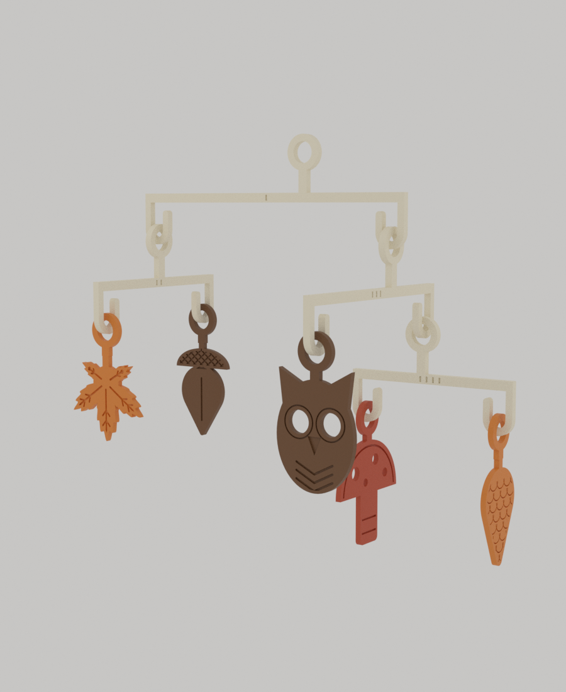
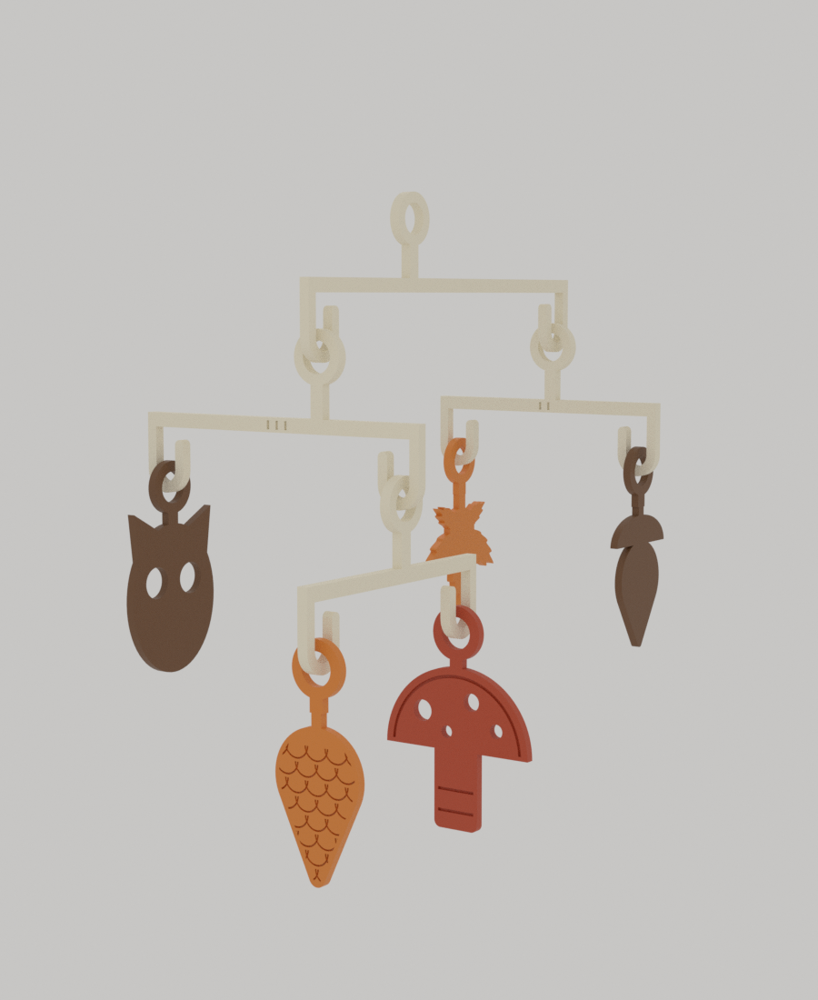
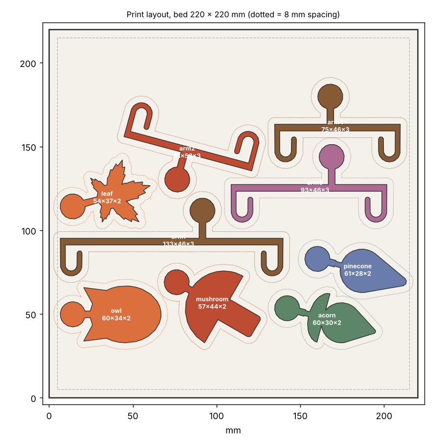

# 07 · Forest Balance Mobile (계산형 숲 모빌)

Autumn Nest 공모전 **Autumn in Motion** 출품작. 부엉이, 단풍잎, 도토리, 버섯, 솔방울 다섯 장식을 매단 칼더식 모빌입니다. 안내문의 Design focus인 **균형, 연결 방식, 조립 용이성**에 맞춰, 각 팔의 받침점을 **실제 장식 질량으로 계산**하고, 연결은 **J자 고리에 링을 끼우는 방식**으로 해서 도구, 접착제, 줄 없이 조립됩니다.

 

## 설계 판단

- **균형은 질량 중심 공식으로 계산합니다.** 팔의 받침점을 (왼쪽 하중 × 0 + 오른쪽 하중 × D + 팔 자체 무게 × D/2) ÷ 전체 무게 로 구합니다. 하중에는 아래에 달린 하위 모빌 전체의 무게가 들어갑니다. `forest_mobile.scad`가 이 식을 풀어 받침 링 위치를 정하므로, 장식 질량을 바꾸면 팔이 저절로 다시 설계됩니다.
- **질량을 예측할 수 있도록 납작하게 만들었습니다.** 모든 부품이 2.4~3mm 두께의 2D 외곽 압출이라 질량이 면적에 비례하고, 벽 6겹(=2.4mm)이면 속이 꽉 차서 예측이 맞습니다.
- **연결은 J자 갈고리 + 링입니다.** 팔 끝의 갈고리 끝(팁)에 링을 눕혀서 씌우고 굽은 곳으로 내려 세우면 끝입니다. 줄이나 부품이 따로 없습니다. 링은 갈고리에 수직이라서 층마다 장식 면이 90° 엇갈립니다. 회전하는 모빌이라 어느 방향에서든 앞면이 보입니다.
- **한 베드에 납작하게 눕혀 출력합니다.** 서포트가 없고 모든 부품이 같은 설정입니다.
- 팔은 **새긴 눈금(1~4개)** 으로 구분합니다.

## 구성

| 팔 | 눈금 | 왼쪽 갈고리 | 오른쪽 갈고리 | 갈고리 간격 D | 받침 링 위치(왼쪽 갈고리에서) | 이 팔이 매다는 무게 |
|---|---|---|---|---|---|---|
| A1 (맨 위) | 1 | A2 (잎+도토리) | A3 (부엉이+A4) | 120mm | 78.4mm | 25.1g |
| A2 | 2 | 단풍잎 | 도토리 | 66mm | 35.1mm | 7.2g |
| A3 | 3 | 부엉이 | A4 | 80mm | 53.6mm | 14.7g |
| A4 | 4 | 버섯 | 솔방울 | 62mm | 26.7mm | 8.4g |

**왼쪽/오른쪽은 새긴 눈금이 보이는 면을 앞으로, 받침 링을 위로 들었을 때 기준입니다.** 받침 링은 무거운 쪽에 더 가깝습니다.

장식 질량(PLA 솔리드, STL 부피로 측정): 부엉이 3.57g, 단풍잎 2.08g, 도토리 2.50g, 버섯 3.46g, 솔방울 2.39g. 전체 25.1g, 조립 크기 약 181 × 110 × 175mm.

## 조립 (아래에서 위로)

1. **A4(눈금 4)**: 왼쪽 갈고리에 버섯, 오른쪽 갈고리에 솔방울을 겁니다.
2. **A2(눈금 2)**: 왼쪽에 단풍잎, 오른쪽에 도토리.
3. **A3(눈금 3)**: 왼쪽에 부엉이, 오른쪽에 A4의 받침 링을 겁니다.
4. **A1(눈금 1)**: 왼쪽에 A2, 오른쪽에 A3의 받침 링을 겁니다.
5. A1 맨 위 링에 낚싯줄이나 얇은 줄을 걸어 매답니다.

링 거는 법: 링을 눕혀서(수평으로) 갈고리 끝에 위에서 씌우고, U자 굽은 곳까지 밀어 내린 뒤 링을 세웁니다.

## 검증 결과

`python tools/mobile_check.py 07-forest-mobile/forest_mobile.scad --twist`로 측정했습니다. 공식과 별개로 **조립한 STL 메시**의 부피와 무게중심을 쓴 검증입니다.

| 항목 | 결과 |
|---|---|
| 부품 9종 | 모두 단일 몸체 수밀, 서포트가 필요한 오버행 0 |
| 균형(무게중심과 받침 링의 거리) | 4개 팔 모두 **0.06mm 이하**, 기울기 0.1° 이하 |
| 질량 오차 민감도 | 한 부품이 5% 무겁게 출력돼도 기울기 **0.7° 이하**. 팔만 10% 가볍게 출력돼도 0.2° 이하 |
| 연결부 간극 | 링 구멍과 갈고리 사이 1.78mm 이상 |
| 회전 여유(형제 하위 모빌 사이) | 18.3mm 이상 (각 하위 모빌이 자기 축으로 돌아도 서로 닿지 않음) |
| 연결부 비틀림 범위 | 링이 갈고리에 걸린 채 한쪽으로 약 **35~45°** 비틀림 (메시 충돌 검사) |

검증 과정에서 고친 실제 문제 3가지입니다.
- 받침대가 링 구멍을 메우고 있어서 링이 갈고리에 파고들었습니다(검증 스크립트가 잡음).
- 도토리와 솔방울이 3조각, 2조각으로 갈라져 있었습니다(몸체 개수 검사 추가).
- 링 구멍 ⌀6일 때 비틀림이 ±15~30°였고, ⌀9로 키워 ±35~45°가 됐습니다. 처음 측정에서는 ±3~9°로 나왔는데, 링이 각도에 따라 걸리는 위치(처짐)가 바뀌는 것을 고려하지 않은 측정 오류였습니다.

## 출력

- 부품 9개를 **한 베드에 납작하게** 배치했습니다. 새긴 면(눈금, 장식 문양)이 위로 오게 둡니다.

| 베드 | 파일 | 결과 |
|---|---|---|
| 256×256 | `plate_256.3mf`, `plate_256.stl`, `plate_256.png` | 9부품 모두 들어감, 최소 간격 8.2mm |
| 220×220 | `plate_220.3mf`, `plate_220.png` | 9부품 모두 들어감 |
| 180×180 | `plate_180_arms.3mf`, `plate_180_ornaments.3mf` | 한 장에 안 들어가 팔 4개와 장식 5개로 나눔 |



- **설정**: 레이어 0.2mm, **벽 6겹 이상 또는 인필 100%**, 서포트 없음, 부품마다 같은 재질 사용. 질량 비율이 맞아야 하므로 서로 다른 인필이나 재질을 섞지 마세요.
- 링이 뻑뻑하면(출력이 두껍게 나올 때) 링 안쪽을 칼로 다듬거나 `ring_ri`를 4.8로 키워 다시 내보내세요.

## 아직 검증하지 못한 것

- **실제 출력과 조립**: 링과 갈고리 간극은 메시로만 확인했습니다.
- **바람에서의 움직임**: 각 장식은 갈고리 위에서 약 ±40° 비틀리고 갈고리 굽은 곳을 따라 흔들리지만, 실제 바람에서 얼마나 움직이는지는 재 보지 못했습니다. 맨 위 줄이 꼬이면서 전체가 도는 것은 줄에 달려 있어 자유롭습니다.
- **PETG, 다색 출력의 영향**: 질량 비율 가정은 같은 재질로 같은 설정에서 출력할 때만 성립합니다.

## 파라미터 (`forest_mobile.scad`, Customizer 지원)

| 파라미터 | 설명 |
|---|---|
| `m_owl` 등 | 장식 질량(g). 장식을 바꾸면 `python tools/mobile_check.py forest_mobile.scad --apply`로 다시 측정해 반영한 뒤 한 번 더 검증 |
| `D1`~`D4` | 팔의 갈고리 간격. 하위 모빌이 서로 닿지 않는지 검증 스크립트가 확인 |
| `ring_ro`, `ring_ri` | 링 크기(기본 외경 15, 구멍 9mm). 구멍이 커야 비틀림 범위가 넓어짐 |
| `w_h`, `r_h`, `d_h`, `tip_h` | 갈고리 폭, 굽은 반지름, 내려가는 길이, 팁 높이 |
| `t_orn`, `t_arm` | 장식, 팔 두께 (2.4, 3.0mm) |

```bash
for p in owl leaf acorn mushroom pinecone arm1 arm2 arm3 arm4; do openscad -D "part=\"$p\"" -o stl/$p.stl forest_mobile.scad; done
python ../tools/mobile_check.py forest_mobile.scad --twist          # 질량, 균형, 간극, 비틀림 검증
python ../tools/print_layout.py --bed 220 220 --gap 8 --out plate stl/*.stl
```
