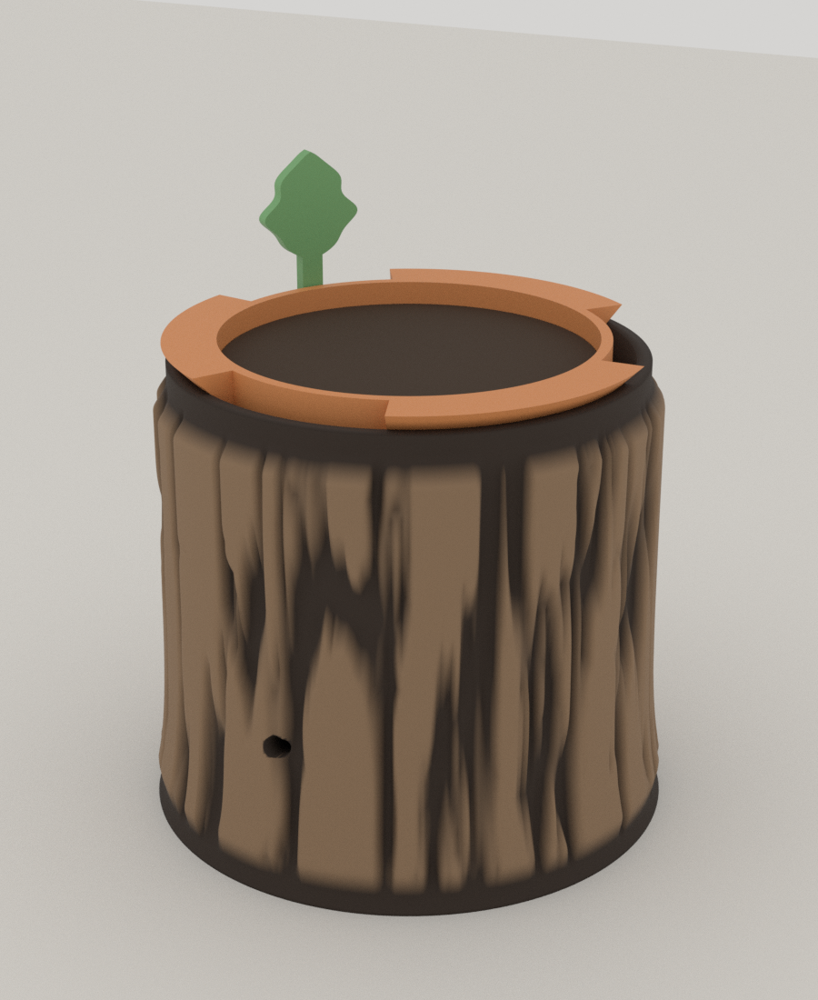
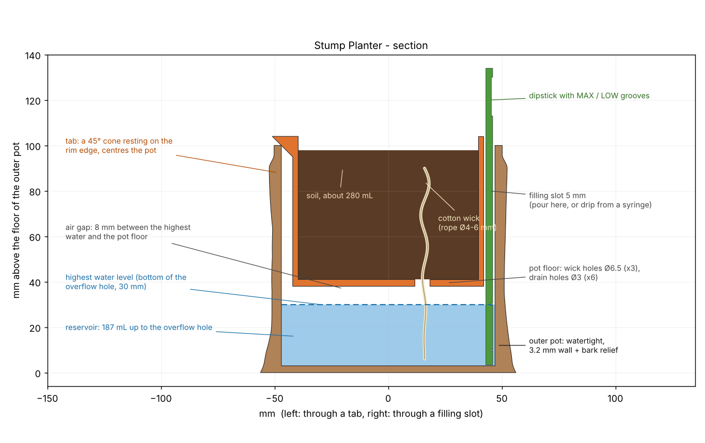

# 08 · Stump Planter (그루터기 자가급수 화분)

Autumn Nest 공모전 **A Forest Corner**(화분) 출품작. 겉은 나무 그루터기 껍질, 속은 **이중 화분(자가급수)** 입니다. 물은 바깥 화분(저수조)에 담고, 흙은 안쪽 화분에 담습니다. 안쪽 화분은 물에 닿지 않고, **면심지(wick)** 가 물을 흙으로 올려 줍니다.



*(Blender 렌더입니다. 껍질 색은 요철 높이로 칠한 것이고 실제 출력은 한 색입니다.)*

## 이 화분이 배수와 안쪽 화분을 어떻게 해결하는가 (공모전 요구 사항)



*(실제 STL을 잘라 그린 단면. 왼쪽은 걸이 턱을 지나는 면, 오른쪽은 급수 틈과 수위 막대를 지나는 면.)*

| 질문 | 답 |
|---|---|
| **안쪽 화분이 있는가?** | 있음. 흙을 담는 안쪽 화분(`pot.stl`)이 바깥 화분 테두리에 **걸이 턱 3개**로 매달립니다. 턱의 아랫면은 45° 원뿔이라 바깥 화분 테두리 안쪽 모서리에 얹히면서 **저절로 가운데로 맞춰집니다** (오버행도 45° 이하). |
| **물은 어디에 담기는가?** | 바깥 화분 바닥에서 30mm까지, **약 187mL**(메쉬 단면을 적분해 계산). 안쪽 화분 바닥은 그 위 8mm에 있어서 **뿌리가 물에 잠기지 않습니다.** |
| **물이 넘치면?** | 바깥 화분 앞쪽에 **Ø5 넘침 구멍**이 있고 구멍의 아래 가장자리가 최고 수위(30mm)입니다. 물이 이 높이를 넘을 수 없으므로 안쪽 화분 바닥(38mm)에 닿는 일이 없습니다. |
| **물을 어떻게 주는가?** | 걸이 턱 사이의 **급수 틈 3개**(턱 사이 50°, 폭 5mm)로 붓습니다. 넘침 구멍에서 물이 똑똑 떨어지면 저수조가 정확히 가득 찬 것입니다. |
| **수위는 어떻게 아는가?** | 틈에 세워 둔 **잎 모양 수위 막대**(`dipstick.stl`). 막대에 MAX(30mm, 넘침 구멍 높이)와 LOW(10mm) 홈이 있고, 5mm마다 짧은 눈금이 있습니다. 빼서 젖은 높이를 봅니다. |
| **흙에는 물이 어떻게 가는가?** | 안쪽 화분 바닥의 Ø6.5 구멍 3개로 **면심지** 3가닥이 내려가 저수조 물에 닿습니다. 흙이 마르면 심지가 물을 빨아 올립니다. |
| **배수는?** | 안쪽 화분 바닥에 Ø3 배수구 6개. 흙에 남는 물이 저수조로 빠집니다. 저수조가 가득 차도 넘침 구멍이 있어서 안쪽 화분에는 닿지 않습니다. (배수성이 좋은 배합토를 쓰세요.) |

## 구성

| 파일 | 설명 |
|---|---|
| `stl/shell.stl` | 바깥 화분(저수조). 지름 112 × 높이 100mm, 껍질 무늬, 밑동이 넓어지는 뿌리 모양, 넘침 구멍. `tools/bark_shell.py`가 생성 (약 16.6만 면) |
| `stl/pot.stl` | 안쪽 화분. 지름 84(턱 포함 102) × 높이 66mm, 심지 구멍 3, 배수구 6, 걸이 턱 3. 흙 약 280mL |
| `stl/dipstick.stl` | 수위 막대, 눕혀서 출력하는 방향 (131 × 23 × 3mm) |
| `stl/dipstick_asm.stl` | 같은 막대를 화분 안에 세운 위치(렌더와 검사용, 출력 안 함) |
| `bark_planter.scad` | 안쪽 화분과 수위 막대의 파라메트릭 소스. `[shell]` 표시가 있는 값은 `bark_shell.py`와 맞아야 합니다 |
| `plate_256.3mf` | **한 베드(256×256)에 전부** 배치 (3개 부품, 베드의 27%) |
| `bed180_brown/orange/green.3mf` | 색상별 베드. 갈색 = 바깥 화분, 주황 = 안쪽 화분, 초록 = 수위 막대. 180×180 베드로 충분 |
| `check.txt` | 검증 로그 |

## 조립과 사용

준비물(출력물 외): **면로프 심지 Ø4–6mm, 길이 약 15cm × 3개**, 배합토 약 280mL, 흙이 구멍으로 새지 않게 깔 **커피 필터 한 장**(또는 망), 물받침 접시.

1. 바깥 화분을 평평한 곳에 놓습니다.
2. 심지 3가닥의 한쪽 끝(흙 쪽)을 매듭지어 안쪽 화분 바닥의 Ø6.5 구멍 3개에 아래에서 위로 넣습니다. 매듭이 걸려서 빠지지 않고, 반대쪽 끝은 아래로 늘어뜨립니다.
3. 안쪽 화분 바닥에 커피 필터를 깔고 배합토를 채웁니다(테두리에서 6mm 아래까지). 심지가 흙 속에 묻히게 합니다.
4. 안쪽 화분을 바깥 화분에 올립니다. 심지는 바깥 화분 바닥에 닿아야 합니다(8mm 공기층을 지나 저수조 안으로 늘어집니다).
5. 급수 틈 하나에 수위 막대를 세웁니다.
6. **처음 한 번은** 흙 위에서 물을 부어 심지를 적셔 줍니다. 이후는 급수 틈으로 넘침 구멍에서 물이 떨어질 때까지 붓고, 수위 막대가 LOW 아래로 내려가면 다시 채웁니다.

식물은 물을 좋아하는 허브(바질, 민트), 고사리, 이끼류가 맞습니다. 다육식물처럼 건조해야 하는 식물에는 맞지 않습니다.

## 출력 권장

| 부품 | 필라멘트 | 설정 |
|---|---|---|
| 바깥 화분 | **PETG** 권장(물이 닿음). 갈색 | 레이어 0.2mm, 외벽 4개 이상, 인필 15%, 서포트 없음. 넘침 구멍 위쪽 5mm 브리지 하나만 있음 |
| 안쪽 화분 | 아무 PLA/PETG. 주황 | 외벽 3개, 서포트 없음 (턱 아랫면 45°) |
| 수위 막대 | 초록 PLA | 눕혀서, 홈이 있는 면이 위 |

바깥 화분은 **물을 24시간 채워서 새는지 먼저 확인**하세요. FDM 출력물은 레이어 사이로 물이 번질 수 있고, 새면 외벽 수와 압출량을 올리거나 안쪽 벽에 방수 코팅(에폭시 등)을 하세요.

## 검증한 것 (`tools/planter_check.py`, 로그는 `check.txt`)

| 항목 | 결과 |
|---|---|
| 세 부품 모두 단일 몸체, 수밀 | 통과 |
| 오버행(45°+1.5° 초과) | 안쪽 화분 0, 수위 막대 0, 바깥 화분 17.5mm² (Ø5 넘침 구멍의 천장, 5mm 브리지) |
| 바깥 화분 벽 두께(레이 캐스팅 2892개) | 최소 3.20mm, 최대 8.33mm(껍질 요철 포함). 껍질은 매끈한 벽 위에만 더해지므로 벽이 설계보다 얇아질 수 없음 |
| 바닥 두께 | 3.00mm |
| 넘침 구멍 | 뚫려 있음, z = 30.05 ~ 34.95mm, 최고 수위 30mm |
| 저수조 용량 (30mm까지) | 187mL |
| 안쪽 화분 흙 용량 (60mm까지) | 281mL |
| 안쪽 화분과 바깥 화분 사이 틈 | 5.0mm (본체와 바닥 샘플 4010점의 최단 거리) |
| 최고 수위와 안쪽 화분 바닥 사이 공기층 | 8.0mm |
| 걸이 턱의 원뿔이 테두리 안쪽 모서리를 지나는 반지름 | 47.00mm (모서리 47.0mm) |
| 심지 구멍 3개, 배수구 6개 | 모두 관통 |
| 수위 막대 | 틈 한가운데(약 150°)에 서고, 안쪽 화분과 1.00mm, 바깥 화분 벽과 0.93mm 떨어져 있음. 끝이 바닥에서 3.4mm 위, MAX 홈이 30.0mm |

## 아직 확인하지 못한 것

- **실제 출력.** 껍질 요철의 출력 품질, 넘침 구멍 브리지, 방수가 확인되지 않았습니다.
- **방수와 장시간 습기.** PLA는 습기와 열에 약합니다. 그래서 바깥 화분은 PETG를 권장하지만 이것도 시험은 못 했습니다.
- **심지의 실제 흡수량.** 면로프 종류에 따라 다릅니다. 저수조 187mL가 며칠 가는지는 식물과 방 환경에 달려 있어 측정하지 않았습니다.
- **식물이 실제로 잘 크는지.**
- 걸이 턱 3개의 **강도.** 젖은 흙 280mL와 안쪽 화분을 합치면 약 400g으로 추정되지만, 턱이 이 무게를 오래 버티는지는 계산도 시험도 하지 않았습니다. 힘은 턱의 원뿔면이 테두리 안쪽 모서리에 닿는 선에 걸립니다. 처짐이 보이면 턱의 호 길이(`tab_arc`)를 늘리거나 턱을 4개로 하세요.

## 껍질(bark) 무늬 만드는 법

바깥 화분의 껍질은 원통 좌표에서 **세로로 길게 늘린 3차원 값 노이즈**로 만듭니다. 원을 따라 연속이라 이음매가 없고, 세로 결이 길어서 오버행이 거의 없습니다. 홈(0)과 능선(1)의 높이 차는 3mm이고 **매끈한 벽 위에 더하기만** 합니다. 위아래 가장자리와 테두리는 매끈하게 줄여서 안쪽 화분이 얹히는 면을 평평하게 유지하고, 밑동은 지수 곡선으로 6mm 넓혀서 뿌리 모양을 만듭니다. 넘침 구멍은 Blender Manifold 불리언으로 뚫습니다. `--seed`를 바꾸면 무늬가 달라져서 같은 화분을 여러 개 만들어도 서로 다릅니다.

## 다시 만들기

```bash
cd autumn-nest
python tools/bark_shell.py 08-bark-planter/stl/shell.stl        # 바깥 화분 (bpy 필요, 30초)
cd 08-bark-planter
openscad -o stl/pot.stl          -D 'part="pot"'          bark_planter.scad
openscad -o stl/dipstick.stl     -D 'part="dipstick"'     bark_planter.scad
openscad -o stl/dipstick_asm.stl -D 'part="dipstick_asm"' bark_planter.scad
cd ..
python tools/planter_check.py 08-bark-planter
python tools/planter_section.py 08-bark-planter 08-bark-planter/section.png
python tools/bark_shell.py /tmp/shell.stl --render 08-bark-planter/preview_assembled.png \
    --pot 08-bark-planter/stl/pot.stl --stick 08-bark-planter/stl/dipstick_asm.stl --soil-z 98 --soil-r 39.4 --elev 22
```

화분 크기나 저수량을 바꾸려면 `bark_shell.py`의 `--ri`, `--height`, `--overflow-z`와 `bark_planter.scad`의 `[shell]` 값을 같이 바꾸세요. `bark_planter.scad`에는 맞지 않을 때 멈추는 `assert`가 있습니다.
