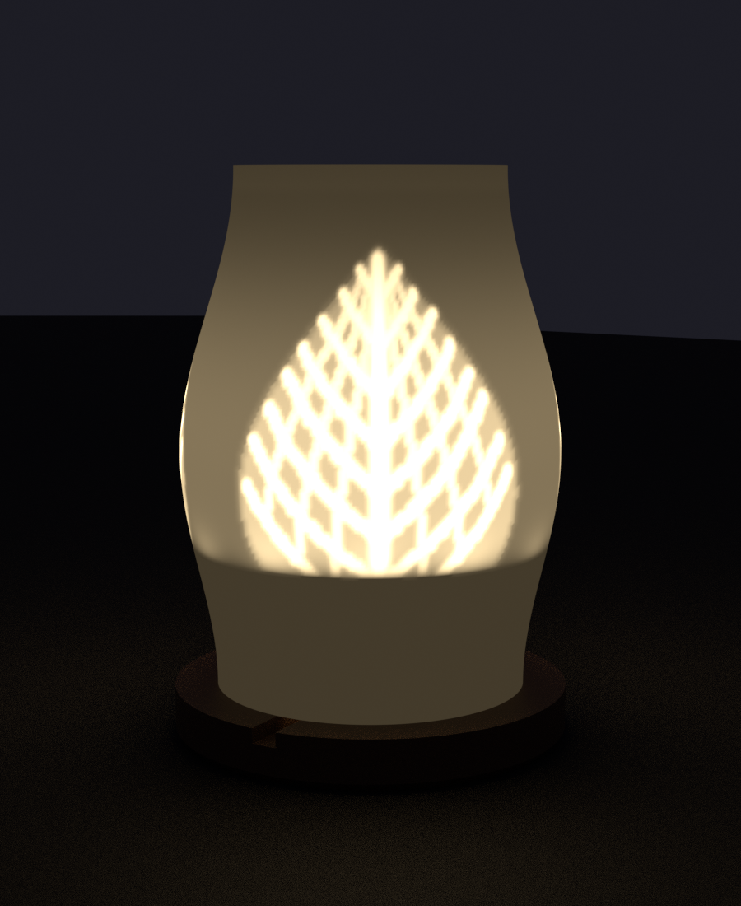
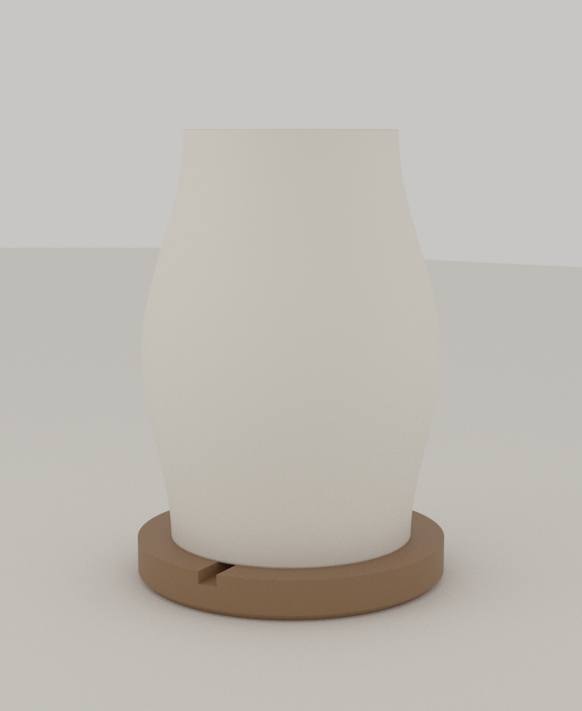
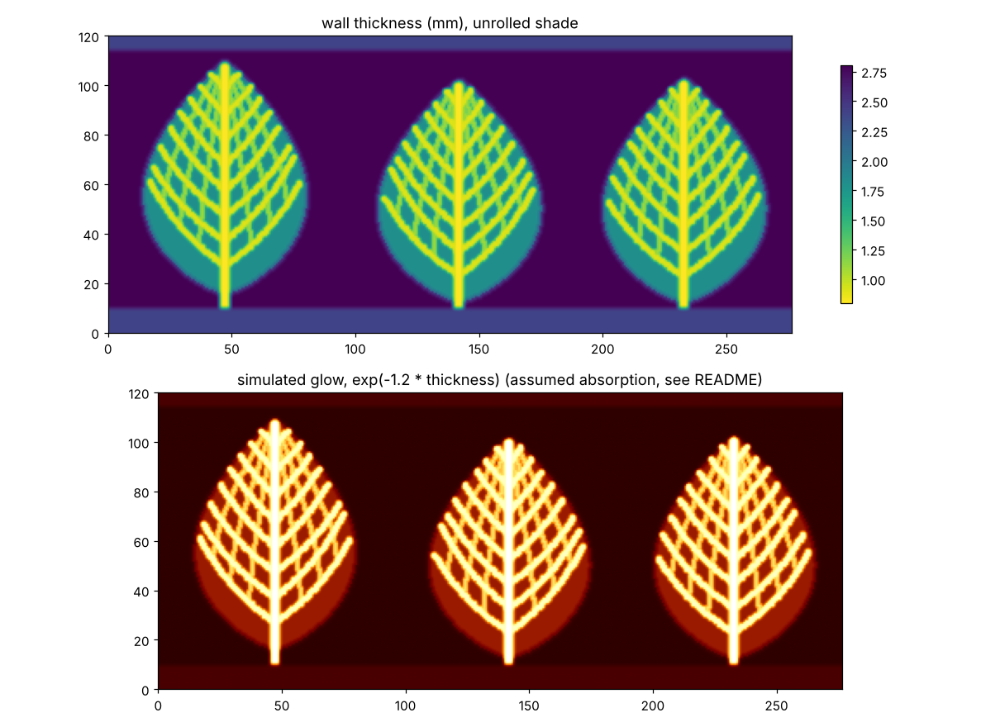
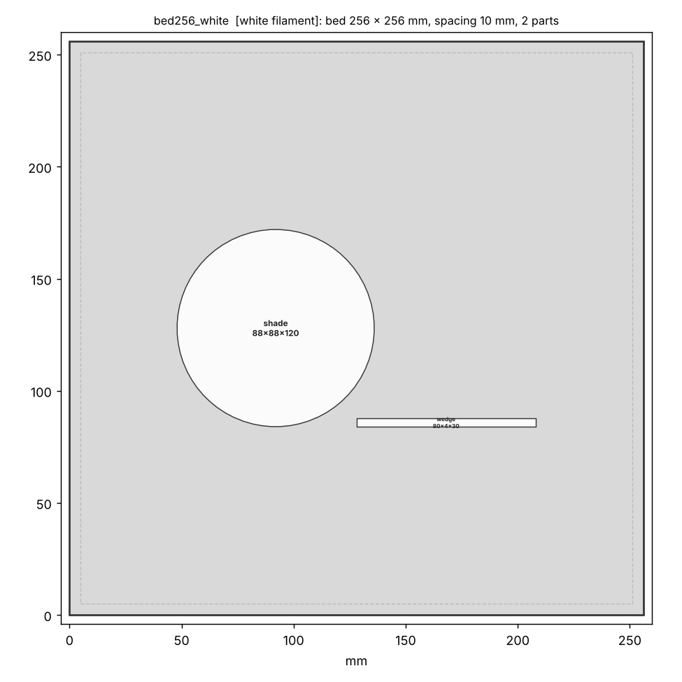
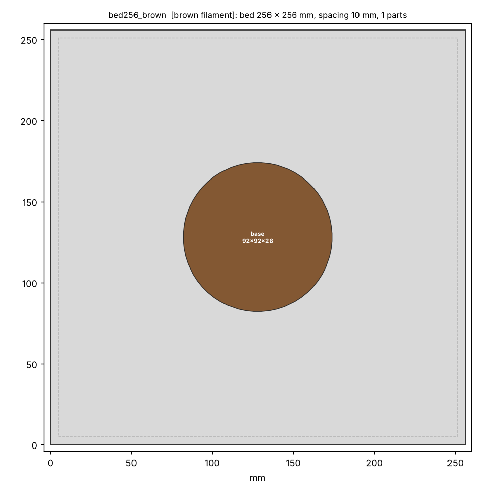

# 10 · Vein-Glow Lantern (잎맥 리소페인 램프)

Autumn Nest 공모전 **A Forest Corner**(램프) 출품작. 꺼져 있을 때는 매끈한 하얀 갓이지만, 켜면 **단풍잎 잎맥이 빛나는** 램프입니다. 리소페인(lithophane) 원리를 씁니다. 플라스틱이 얇은 곳은 빛이 많이 통과하고 두꺼운 곳은 덜 통과하므로, **벽 두께로 그림을 그립니다.**

 

*(켠 모습은 아래 설명한 단순 LED 모델로 계산한 미리보기 렌더이고, 실제 사진이 아닙니다.)*

## 원리

| 영역 | 벽 두께 | 켰을 때 |
|---|---|---|
| 잎맥(주맥, 곁맥, 잔맥) | 0.8mm | 밝게 빛남 |
| 잎살 | 1.8mm | 은은하게 빛남 |
| 배경 | 2.8mm | 어두움 |
| 위아래 테두리 | 2.4mm | 갓을 단단하게 하고 받침에 결합 |

갓 바깥면은 매끈하고, 안쪽면이 두께만큼 들어가 있어서 꺼진 상태에서는 무늬가 안 보입니다. 잎 3장(주맥 + 곁맥 8쌍 + 사다리꼴 잔맥)은 `vein_field.py`가 생성하고(시드로 모양이 바뀜), 각 단계의 두께는 완만한 곡선으로 이어져서 안쪽면 경사가 가팔라지지 않습니다.



*(위: 펼친 갓의 벽 두께 지도, 아래: 단순 모델로 계산한 발광)*

## 구성

| 파일 | 설명 |
|---|---|
| `stl/shade.stl` | 갓. 지름 88 × 높이 120mm, 항아리 모양. 두께 지도로 Blender에서 생성 (13.6MB) |
| `stl/base.stl` | 받침 92 × 92 × 28mm. 갓을 잡아 주는 립, **뱀부랩 LED 퍽(지름 59mm)** 을 올리는 16mm 기둥, USB 케이블 홈 |
| `stl/wedge.stl` | **두께-밝기 보정용 시험편**. 0.8~3.6mm 8단계 (아래 참고) |

## 광원 (뱀부랩 LED 램프 키트 001)

받침은 **Bambu Lab LED Lamp Kit 001 (MH001)** 의 둥근 퍽에 맞춰 설계했습니다.

| 항목 | 값 |
|---|---|
| 크기 | **지름 59mm**, 높이 **18mm** (일부 판매처는 8mm로 표기: **실측해서** `led_h`에 입력) |
| 전원 | DC 5V (USB), **3W**, 따뜻한 백색, 케이블 1.5m |
| 구성품 | LED 1개, BT3×12 나사 2개, **지름 40mm 양면테이프** |

- 위 값은 판매처 사양표(검색 결과)에서 가져왔습니다. 공식 스토어 페이지는 이 환경에서 열 수 없어 직접 확인하지 못했고, **높이가 판매처마다 8mm와 18mm로 다르게 적혀 있습니다.** 캘리퍼스로 재서 `vein_lantern.scad`의 `led_h`를 맞추면 기둥 높이가 자동으로 조정되어 발광면 높이(34mm)가 유지됩니다.
- 나사 구멍 간격은 자료에서 찾지 못해 설계에 쓰지 않았습니다. 퍽은 키트의 양면테이프로 기둥 위에 고정합니다.
- **3W입니다.** 이전에 안내했던 "1W 이하"는 티라이트 기준이었고 이 퍽에는 해당하지 않습니다. 퍽 가장자리는 갓 벽에서 5.4mm 떨어져 있고 위가 열려 있지만, 켜고 30분쯤 뒤에 갓 아래 테두리와 퍽 주변이 뜨겁지 않은지 손으로 확인하세요. PLA는 약 55°C에서 무릅니다. 백열전구나 할로겐은 쓰지 마세요.

## 조립

1. 퍽 뒷면에 키트의 **지름 40mm 양면테이프**를 붙이고, 받침 기둥(지름 44mm) 위에 가운데를 맞춰 붙입니다. 케이블이 나오는 쪽을 받침의 케이블 홈 방향(앞쪽)으로 돌려 맞춥니다.
2. 케이블을 기둥 옆 홈을 따라 내려 받침 가장자리 홈으로 뺍니다(홈 6mm × 3.5mm이므로 케이블 두께가 3.5mm 이하여야 합니다).
3. 갓을 받침 위에 내려놓습니다. 받침의 립(두께 2mm, 갓 안쪽 테두리와 0.35mm 간극)이 갓을 가운데에 잡아 주고, 갓 아래 테두리가 받침 윗면에 얹힙니다. 접착은 필요 없고, 위로 들어 올리면 분리됩니다.
4. USB 5V 어댑터나 보조배터리에 연결하고 어두운 곳에서 확인합니다.

## 출력

- **흰색 PLA**(무광이 좋음), 갓은 **똑바로 세워서**, 서포트 없음, 레이어 0.2mm.
- **벽 7겹 이상(2.8mm) 또는 인필 100%** 로 속이 꽉 차게 출력하세요. 성긴 인필은 안에서 빛이 비칠 때 격자 무늬로 보입니다.
- 이음선(seam)은 뒷면으로 지정하세요. 부피 62.4cm³라 시간은 슬라이서로 확인하세요(솔리드 기준 약 77g).
- 받침은 일반 설정(인필 15~20%)으로 됩니다.
- **색상별 베드**: 필라멘트를 바꾸지 않고 베드마다 한 색으로 출력하도록 나눴습니다.

| 베드 | 필라멘트 | 부품 | 256mm 베드 | 180mm 베드 |
|---|---|---|---|---|
| 흰색 | **흰색 PLA** | 갓 + 보정 시험편 | `bed256_white.3mf` | `bed180_white.3mf` |
| 갈색 | 자유(렌더는 갈색) | 받침 | `bed256_brown.3mf` | `bed180_brown.3mf` |

  - 시험편은 반드시 갓과 **같은 흰색 필라멘트**로 출력해야 두께-밝기 보정이 맞습니다. 그래서 같은 베드에 두었습니다.
  - 받침 색은 자유입니다. 색을 바꾸면 `bed*_brown`을 그 색의 베드로 쓰면 됩니다.
  - 갓(88mm)과 받침(92mm)을 따로 두었으므로 베드 한 변이 약 105mm 이상이면 출력할 수 있습니다.
  - 모두 한 가지 색으로 출력하려면 갓, 받침, 시험편이 한 베드에 들어 있는 `plate_256.3mf`(256mm), `plate_220.3mf`(220mm)를 쓰세요.

 

## 먼저 시험편으로 보정하세요

두께와 밝기의 관계는 필라멘트와 LED마다 다릅니다. 이 설계는 흰색 PLA의 빛 흡수를 **가정값(1.2/mm)** 으로 계산했을 뿐 측정하지 못했습니다. `wedge.stl`을 출력해서 어두운 방에서 LED를 뒤에 대고 보면 두께별 밝기를 알 수 있습니다. 잎맥으로 쓸 만큼 밝은 가장 얇은 단계와 배경으로 쓸 만큼 어두운 단계를 골라 두께를 정한 뒤 갓을 다시 생성합니다.

```bash
python ../tools/vein_field.py field.npz --t-vein 0.8 --t-mem 1.8 --t-bg 2.8 --preview field_map.png
python ../tools/blender_vein_shade.py field.npz stl/shade.stl --base stl/base.stl --lit preview_lit.png --unlit preview_unlit.png
```

## 빛 분포 (중요)

LED 하나로 키가 큰 갓을 비추면 LED에 가까운 쪽이 훨씬 밝습니다(거리 제곱에 반비례). 그래서 받침에 **기둥**을 세워 퍽의 발광면을 갓 아래 가장자리 위 **34mm** 높이에 두었습니다. `lamp_light.py`의 단순 모델(지름 59mm 원판의 윗면이 Lambertian으로 발광, 흡수 1.2/mm 가정)로 높이별 위아래 잎맥 밝기 비를 비교했습니다.

| 발광면 높이 | 아래 잎맥 | 위 잎맥 | 위/아래 |
|---|---|---|---|
| 29mm | 0.30 | 0.19 | 0.61 (위가 어두움) |
| **34mm (설계값)** | 0.22 | 0.22 | **0.96** |
| 39mm | 0.10 | 0.25 | 2.48 (아래가 어두움) |

발광면이 갓 아래 가장자리 위 약 34mm일 때 가장 고르고, 높이에 민감합니다(5mm 높으면 비가 2.5배). 퍽 높이를 실측해 `led_h`에 넣으면 기둥이 자동 조정됩니다. 모델은 갓 안쪽의 반사나 벽 속 산란을 단순화한 것이라 절댓값보다 "높이에 민감하다"는 경향을 보는 용도입니다.

## 검증 결과

`python tools/lantern_check.py 10-vein-lantern --field 10-vein-lantern/field.npz`로 측정했습니다.

| 항목 | 결과 |
|---|---|
| 갓, 받침 | 각각 단일 몸체 수밀. 서포트가 필요한 오버행 갓 0.16%(위쪽 돔 안쪽, 대부분 45~55°), 받침 0% |
| 갓 벽 두께(메시에서 법선 방향 레이캐스트) | 최소 **0.80mm**, 두께 지도와 최대 오차 **0.000mm** |
| 갓과 받침의 결합 | 간섭 0, 립과 갓 안쪽 테두리 간극 **0.35mm** |
| 퍽(59×18mm)과 받침, 갓 | 접촉 0(받침 기둥에 테이프로 붙는 면만 접함), 립과 10.2mm 이상 |
| 열 여유 | 퍽 가장자리와 갓 벽 **5.4mm**, 퍽 위 개구부 86mm (3W이므로 켜 보고 확인) |

## 아직 검증하지 못한 것

- **퍽의 실제 치수**: 지름 59mm는 판매처가 일치하지만 높이는 8mm와 18mm로 갈립니다. 케이블이 나오는 위치와 굵기, 나사 구멍 위치도 모릅니다. 가지고 계신 퍽을 재서 `led_d`, `led_h`를 확인하세요.
- **발열**: 3W 퍽 가장자리가 갓 벽 5.4mm 옆에 있습니다. 실제로 켜서 온도를 확인해야 합니다.
- **실제 투과율**: 흰색 PLA의 흡수 계수와 LED 밝기는 가정이라 켰을 때의 밝기와 대비는 실물로 확인해야 합니다(시험편으로 보정).
- **출력**: 높이 120mm에 벽이 0.8~2.8mm로 달라지는 곡면 갓이 실제로 잘 출력되는지는 확인하지 못했습니다.

## 파라미터

| 파일 | 파라미터 |
|---|---|
| `vein_field.py` | `--leaves`(잎 수), `--seed`(잎맥 모양), `--height`, `--r-bottom/--r-max/--r-top`(갓 모양), `--t-vein/--t-mem/--t-bg`(두께), `--res`(해상도, 기본 0.7mm) |
| `vein_lantern.scad` | `led_d`, `led_h`(퍽 지름, 높이), `face_z`(발광면 높이, 기본 34), `tape_d`, `usb_groove`, `shade_r0`(갓 바닥 반지름과 일치해야 함), `clr`, `base_r` |

```bash
openscad -D 'part="base"'  -o stl/base.stl  vein_lantern.scad
openscad -D 'part="wedge"' -o stl/wedge.stl vein_lantern.scad
python ../tools/lantern_check.py . --field field.npz   # 퍽 크기는 --led-d 59 --led-h 18 --face-z 34
python ../tools/print_layout.py --bed 256 256 --gap 10 --out plate stl/shade.stl stl/base.stl stl/wedge.stl
```
