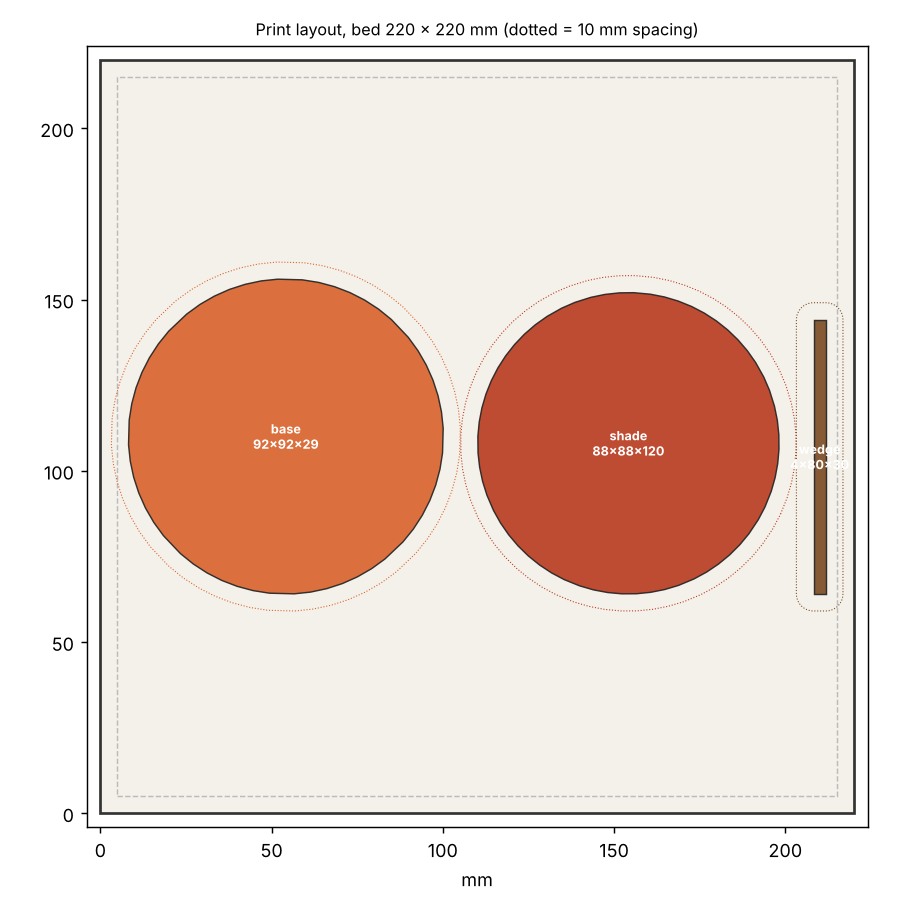

# 10 · Vein-Glow Lantern (잎맥 리소페인 램프)

Autumn Nest 공모전 **A Forest Corner**(램프) 출품작. 꺼져 있을 때는 매끈한 하얀 갓이지만, 켜면 **단풍잎 잎맥이 빛나는** 램프입니다. 리소페인(lithophane) 원리를 씁니다. 플라스틱이 얇은 곳은 빛이 많이 통과하고 두꺼운 곳은 덜 통과하므로, **벽 두께로 그림을 그립니다.**

 

*(켠 모습은 아래 설명한 단순 LED 모델로 계산한 미리보기 렌더이고, 실제 사진이 아닙니다.)*

## 원리

| 영역 | 벽 두께 | 켰을 때 |
|---|---|---|
| 잎맥(주맥, 곁맥, 잔맥) | 0.8mm | 밝게 빛남 |
| 잎살 | 1.8mm | 은은하게 빛남 |
| 배경 | 2.8mm | 어두움 |
| 위아래 테두리 | 2.4mm | 갓을 단단하게 하고 받침에 결합 |

갓 바깥면은 매끈하고, 안쪽면이 두께만큼 들어가 있어서 꺼진 상태에서는 무늬가 안 보입니다. 잎 3장(주맥 + 곁맥 8쌍 + 사다리꼴 잔맥)은 `vein_field.py`가 생성하고(시드로 모양이 바뀜), 각 단계의 두께는 완만한 곡선으로 이어져서 안쪽면 경사가 가팔라지지 않습니다.


*(위: 펼친 갓의 벽 두께 지도, 아래: 단순 모델로 계산한 발광)*

## 구성

| 파일 | 설명 |
|---|---|
| `stl/shade.stl` | 갓. 지름 88 × 높이 120mm, 항아리 모양. 두께 지도로 Blender에서 생성 (13.6MB) |
| `stl/base.stl` | 받침 92 × 92 × 29mm. 갓을 잡아주는 립, LED 포켓과 17mm 기둥(riser), USB 케이블 홈 |
| `stl/wedge.stl` | **두께-밝기 보정용 시험편**. 0.8~3.6mm 8단계 (아래 참고) |

## 광원 (호환 사양)

| 항목 | 사양 |
|---|---|
| **권장** | 따뜻한 백색(2700~3000K) **LED 티라이트**, 지름 38~39mm × 높이 약 20mm, 배터리식 |
| 대안 | 5V USB 따뜻한 백색 LED 퍽(지름 약 38mm), **최대 1W** (받침 USB 홈으로 케이블 통과) |
| **금지** | 백열전구, 할로겐, 1W를 넘는 광원, 밀폐 상태에서 열이 나는 모든 것. PLA는 약 55°C에서 무릅니다 |

LED 높이가 중요합니다(아래 "빛 분포"). 티라이트 발광점이 바닥에서 약 17mm라고 가정했으니, 사용하는 제품이 다르면 `vein_lantern.scad`의 `riser_h`, `led_emit_h`를 바꾸세요.

## 조립

1. LED 티라이트를 받침 기둥 위 포켓(지름 39.5mm)에 넣습니다. USB 퍽이면 케이블을 기둥 옆 홈을 따라 내려 받침 가장자리 홈으로 뺍니다(홈 6mm × 3.5mm, 케이블 두께 3mm 이하).
2. 갓을 받침 위에 내려놓습니다. 받침의 립(두께 2mm, 갓 안쪽 테두리와 0.35mm 간극)이 갓을 가운데에 잡아 주고, 갓 아래 테두리가 받침 윗면에 얹힙니다. 접착이 필요 없습니다.
3. 불을 켜고 어두운 곳에서 확인합니다. 갓은 위로 들어 올리면 분리되어 LED를 교체할 수 있습니다.

## 출력

- **흰색 PLA**(무광이 좋음), 갓은 **똑바로 세워서**, 서포트 없음, 레이어 0.2mm.
- **벽 7겹 이상(2.8mm) 또는 인필 100%** 로 속이 꽉 차게 출력하세요. 성긴 인필은 안에서 빛이 비칠 때 격자 무늬로 보입니다.
- 이음선(seam)은 뒷면으로 지정하세요. 부피 62.4cm³라 시간은 슬라이서로 확인하세요(솔리드 기준 약 77g).
- 받침은 일반 설정(인필 15~20%)으로 됩니다.
- 한 베드 배치: `plate_256.3mf`(256mm), `plate_220.3mf`(220mm)에 갓, 받침, 시험편이 모두 들어갑니다(간격 10mm 이상). 더 작은 베드에서는 각각 따로 출력하세요(갓 88mm, 받침 92mm).



## 먼저 시험편으로 보정하세요

두께와 밝기의 관계는 필라멘트와 LED마다 다릅니다. 이 설계는 흰색 PLA의 빛 흡수를 **가정값(1.2/mm)** 으로 계산했을 뿐 측정하지 못했습니다. `wedge.stl`을 출력해서 어두운 방에서 LED를 뒤에 대고 보면 두께별 밝기를 알 수 있습니다. 잎맥으로 쓸 만큼 밝은 가장 얇은 단계와 배경으로 쓸 만큼 어두운 단계를 골라 두께를 정한 뒤 갓을 다시 생성합니다.

```bash
python ../tools/vein_field.py field.npz --t-vein 0.8 --t-mem 1.8 --t-bg 2.8 --preview field_map.png
python ../tools/blender_vein_shade.py field.npz stl/shade.stl --base stl/base.stl --lit preview_lit.png --unlit preview_unlit.png
```

## 빛 분포 (중요)

LED 하나로 키가 큰 갓을 비추면 LED에 가까운 쪽이 훨씬 밝습니다(거리 제곱에 반비례). 그래서 받침에 **기둥(riser)** 을 세워 LED를 올렸습니다. `lamp_light.py`의 단순 모델(점광원, 위쪽 반구만 발광, 기둥이 아래쪽 벽을 가림, 흡수 1.2/mm 가정)로 높이별 위아래 잎맥 밝기 비를 비교했습니다.

| LED 높이(갓 바닥 기준) | 아래 잎맥 | 위 잎맥 | 위/아래 |
|---|---|---|---|
| 22mm | 0.53 | 0.23 | 0.43 (위가 어두움) |
| **31mm (설계값)** | 0.35 | 0.32 | **0.92** |
| 40mm | 0.10 | 0.45 | 4.28 (아래가 어두움) |

**LED 높이에 매우 민감합니다.** 설계값에서 ±9mm만 벗어나도 비가 0.43~4.3으로 크게 바뀝니다. 티라이트마다 높이가 다르므로, 위아래 밝기가 고르지 않으면 `riser_h`를 조절해 받침을 다시 출력하거나 LED 아래에 동전이나 와셔를 깔아 높이를 맞추세요. 이 모델은 갓 안쪽의 반사나 벽 속 산란을 단순화한 것이라, 높이의 절댓값보다 "민감하다"는 경향을 보는 용도입니다.

## 검증 결과

`python tools/lantern_check.py 10-vein-lantern --field 10-vein-lantern/field.npz`로 측정했습니다.

| 항목 | 결과 |
|---|---|
| 갓, 받침 | 각각 단일 몸체 수밀. 서포트가 필요한 오버행 갓 0.16%(위쪽 돔 안쪽, 대부분 45~55°), 받침 0% |
| 갓 벽 두께(메시에서 법선 방향 레이캐스트) | 최소 **0.80mm**, 두께 지도와 최대 오차 **0.000mm** |
| 갓과 받침의 결합 | 간섭 0, 립과 갓 안쪽 테두리 간극 **0.35mm** |
| 열 여유 | LED 몸체와 벽 15.3mm, LED 위 개구부 86mm |

## 아직 검증하지 못한 것

- **실제 투과율**: 흰색 PLA의 흡수 계수와 LED 밝기는 가정이라 켰을 때의 밝기와 대비는 실물로 확인해야 합니다(시험편으로 보정).
- **출력**: 높이 120mm에 벽이 0.8~2.8mm로 달라지는 곡면 갓이 실제로 잘 출력되는지는 확인하지 못했습니다.
- **LED 높이**: 티라이트의 실제 발광점 높이를 17mm로 가정했습니다.

## 파라미터

| 파일 | 파라미터 |
|---|---|
| `vein_field.py` | `--leaves`(잎 수), `--seed`(잎맥 모양), `--height`, `--r-bottom/--r-max/--r-top`(갓 모양), `--t-vein/--t-mem/--t-bg`(두께), `--res`(해상도, 기본 0.7mm) |
| `vein_lantern.scad` | `riser_h`, `led_emit_h`, `led_d`, `usb_groove`, `shade_r0`(갓 바닥 반지름과 일치해야 함), `clr`, `base_r` |

```bash
openscad -D 'part="base"'  -o stl/base.stl  vein_lantern.scad
openscad -D 'part="wedge"' -o stl/wedge.stl vein_lantern.scad
python ../tools/lantern_check.py . --field field.npz
python ../tools/print_layout.py --bed 256 256 --gap 10 --out plate stl/shade.stl stl/base.stl stl/wedge.stl
```
