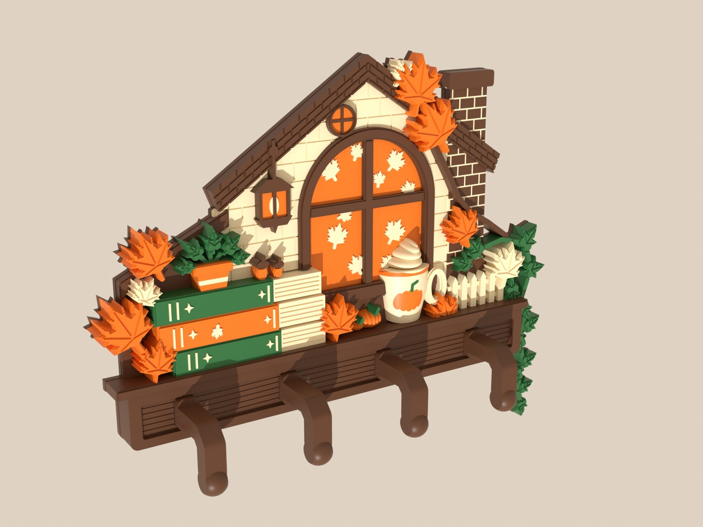
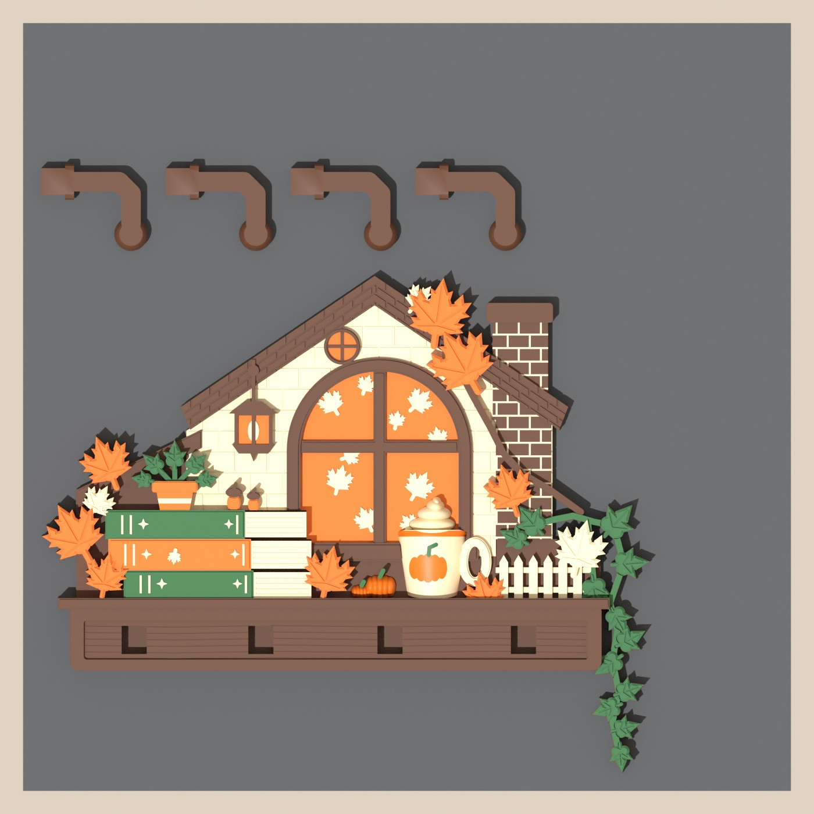
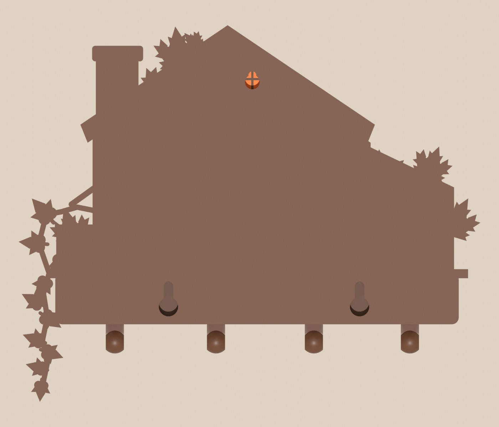

# 🍂 가을 독서 벽걸이 키홀더 (Autumn Reading Key Holder)

레퍼런스 이미지(책 더미가 놓인 오두막 선반 + 호박 라떼 + 단풍·담쟁이, 선반 아래 후크 4개)를
**4색 멀티컬러 릴리프**로 옮긴 OpenSCAD 모델입니다. 고양이·솔방울은 빼고 그 자리에 책 위 작은 화분·도토리, 선반 위 미니 호박을 넣었습니다. 본체와 후크 4개를 **한 베드(256×256)** 에 배치했고,
색은 **4가지(갈색·크림·주황·초록)** 만 씁니다.

| 정면 (레퍼런스와 같은 구도) | 3/4 시점 |
|---|---|
|  |  |

| 프린트 베드 배치 (본체 + 후크 4개) | 뒷면 (걸이 3곳: 아래 키홀 2 + 위쪽 못 1) |
|---|---|
|  |  |

---

## 1. 파일 구성

```
autumn_keyholder.scad          ← 파라메트릭 원본 (OpenSCAD 2021.01+)
print/
  bed_brown.stl  bed_cream.stl  bed_orange.stl  bed_green.stl   ← 색상별 STL (같은 원점, 한 베드 배치)
  autumn_keyholder_4color.3mf  ← 위 4개를 "한 오브젝트 · 파트 4개 · 필라멘트 1~4번" 으로 묶은 3MF
preview/                       ← Blender 렌더 이미지 + autumn_keyholder_preview.blend
scripts/
  build.sh                     ← SCAD → 색상별 STL → 3MF 한 번에
  make_3mf.py                  ← STL 4개 → 멀티파트 3MF
  blender_preview.py           ← Blender 헤드리스: 재질 입히고 정면/3/4/뒷면/베드 렌더 + .blend 저장
```

## 2. 색상 (필라멘트 슬롯 1~4)

| 슬롯 | 색 | 쓰인 곳 | 사용량* |
|---|---|---|---|
| 1 | 호두 갈색 `#5a3825` | 뒷판(2.4mm 전체), 선반, 지붕, 굴뚝·벽돌, 창틀·창살, 다락창 테두리, 랜턴, 덩굴, 도토리 모자, **후크 4개** | 88.4 g |
| 2 | 아이보리 `#f3e2bd` | 집 벽, 책 페이지·장식, 머그컵·휘핑크림, 울타리, 화분 띠, 노란 단풍(→크림), 창문 속 잎, 벽돌 줄눈 | 25.6 g |
| 3 | 단풍 주황 `#e8731d` | 창문·다락창 빛, 랜턴 불빛, 가운데 책(빨강→주황), 화분, 도토리, 단풍잎, 컵 위·미니 호박 | 25.3 g |
| 4 | 숲 초록 `#2f6b3c` | 책 2권, 담쟁이 잎·줄기(화분 식물 포함), 호박 꼭지 | 18.4 g |

\* PrusaSlicer 2.7.2 로 4-extruder 슬라이싱한 값이며, 슬롯별 값에는 색 교체용 **퍼지(프라임) 타워** 몫이 포함돼 있습니다. 합계 약 158 g 중 약 35 g 이 퍼지 타워입니다(Bambu 는 플러시 설정에 따라 다름).
4색 제한 때문에 레퍼런스의 **빨강 → 주황**, **노랑 → 크림**, **황동 후크 → 갈색** 으로 치환했습니다.

## 3. 프린트

- **출력 자세**: 본체는 뒷면(벽에 닿는 면)이 베드에 닿게 엎어서(릴리프가 위로), 후크는 옆으로 눕혀서 → 층결이 후크 팔 방향을 따라가 하중에 강합니다. 서포트 필요 없음.
- **베드 배치**: 본체 204×166 mm, 후크 4개 가로 한 줄. 오른쪽 위 약 40×40 mm 이상이 비어 있어 **프라임 타워** 자리로 쓰면 됩니다.
- **슬라이서에서 불러오기**
  - PrusaSlicer: `autumn_keyholder_4color.3mf` 를 열면 파트 4개가 1~4번 압출기로 이미 지정돼 있습니다.
  - Bambu Studio / OrcaSlicer: `bed_*.stl` 4개를 한꺼번에 선택해서 열고, *"멀티파트 오브젝트로 불러오기"* 에 **예** → 파트마다 필라멘트 1~4 지정 (3MF 도 시도해 볼 수 있으나 아래 "검증" 참고).
- **권장 설정**: 노즐 0.4 · 층 0.2 · 벽 3 · 윗면 5층 · 채움 15% · 서포트 OFF · 브림 불필요 · 프라임 타워 ON
- **규모**: 70층, 색 교체 약 167회. 단색 기준 약 10시간(PrusaSlicer 기본 속도)이며 색 교체 시간이 추가됩니다. Bambu 계열은 더 빠릅니다.

## 4. 조립 · 설치

1. 후크 4개를 선반 앞판의 사각 구멍(8.4×9.4mm, 깊이 8.5mm)에 끼웁니다. 장부는 8×9×8mm(한쪽 0.2mm 여유)이며 순간접착제/에폭시를 바르면 단단합니다.
2. **걸이는 뒷면에 3곳**입니다. 모두 "큰 구멍에 머리를 넣고 아래로 슬라이드" 하는 같은 방식이고, 수치는 아래와 같습니다.

   | 걸이 | 위치 (왼쪽 아래 나사 기준) | 맞는 못/나사 |
   |---|---|---|
   | **위쪽 못 1** (다락창 뒤) | 오른쪽 **47.1mm**, 위 **99.0mm** — 본체+후크의 **무게중심 바로 위** | 머리 Ø ≤5.4mm, 머리 두께 ≤2mm, 몸통 ≤3.2mm (일반 못·작은 나사) |
   | 아래 키홀 2 (선반 뒤) | 왼쪽 나사 (0, 0), 오른쪽 나사 **84.0mm 옆, 같은 높이** | 머리 Ø 6.5~7.4mm, 머리 두께 ≤3.2mm, 몸통 ≤3.8mm |

   - **무게중심** 은 STL 부피중심으로 측정한 값(왼쪽 선반 끝에서 94.8mm)이고, 위쪽 못이 그 바로 위라서 **못 하나만으로도 수평으로 걸립니다.** 키를 걸면 아래쪽이 앞으로 쏠리므로 아래 나사 2개로 눌러 주는 것을 권장합니다.
   - **순서**: 위쪽 못을 먼저 박고 본체를 걸어 수평을 본 뒤, 아래 키홀 위치를 연필로 표시해 나사를 박으세요. 아래 나사는 슬롯 길이(9mm) 안이면 어디든 괜찮아서 높이 오차에 여유가 있습니다.
   - 나사/못은 **머리 밑면이 벽에서 2.6~3mm** 떨어지게 합니다(뒷판 2.4mm 가 머리 밑에 끼워지는 구조).
3. 치수를 바꾸려면 SCAD 의 `KH_*`(아래 키홀) 또는 `NAIL_*`(위쪽 못) 변수를 수정하세요. 다락창은 `NAIL_X` 위치를 따라가며 크기가 자동으로 맞춰집니다.

## 5. 설계 방식 (OpenSCAD)

- 형상은 **레퍼런스 이미지 픽셀 좌표**로 그리고 `S = 0.205 mm/px` 로 mm 변환합니다. 같은 격자에서 렌더 결과와 이미지를 직접 겹쳐 볼 수 있었습니다.
- **뒷판 2.4mm(갈색) + 색상별 릴리프**. 앞뒤 순서(번호가 클수록 앞)를 정해 두고, 앞에 있는 아이템의 2D 외곽을 뒤 아이템에서 빼서 **색상끼리 부피가 겹치지 않게** 만들었습니다(검증값은 아래).
- 컵·미니 호박 같은 곡면은 3D 타원체/회전체를 쓰고, 컵의 호박·테두리는 표면 1~2mm 껍질만 다른 색으로 칠하는 방식(`skin()`)이라 색 교체 층이 많아지지 않습니다.
- 위쪽 못걸이는 얇은 지붕 띠에는 포켓이 안 들어가서, 지붕 아래 박공 벽에 **둥근 다락창**(두꺼운 부분)을 올리고 그 뒷면에 팠습니다. 가는 줄기·잎자루는 끊어지기 쉬워 줄기를 2mm로 굵게 했습니다.
- 잎은 연(kite) 조각 5장을 합친 단풍잎/담쟁이잎 생성기, 각 잎은 3단 경사 + 잎맥 음각.

주요 파라미터(`autumn_keyholder.scad` 맨 위):

| 변수 | 의미 | 기본값 |
|---|---|---|
| `PART` | `"all"`(미리보기) / `"brown"` `"cream"` `"orange"` `"green"` | `"all"` |
| `ASSEMBLED` | `true` = 후크를 끼운 완성 형상, `false` = 베드 배치 | `false` |
| `S` | 전체 크기 배율(mm/px). 0.205 → 폭 약 204mm | 0.205 |
| `ZB`, `Z_*` | 뒷판 두께, 각 요소 높이 | 2.4 … |
| `HK_X`, `HK_*` | 후크 위치·길이·공차 | 4개 |
| `KH_*` | 아래 키홀 위치·치수 | 2개 |
| `NAIL_*` | 위쪽 못걸이(무게중심 x, 머리·몸통·포켓 치수) | `NAIL_X=750` |
| `BED`, `BED_M`, `HK_GAP` | 베드 크기(Blender 미리보기용), 가장자리 여유, 후크 간격 | 256, 6, 6 |

## 6. 다시 만들기

```bash
sudo apt install openscad            # 2021.01 에서 확인 (Manifold 빌드면 훨씬 빠름)
./scripts/build.sh                   # out/ 에 STL, print/ 에 STL 4개 + 3MF   (4코어 약 1.5분)
blender -b --factory-startup -P scripts/blender_preview.py -- out/asm out/preview front iso side back
blender -b --factory-startup -P scripts/blender_preview.py -- out/bed out/preview bed
```

## 7. 검증한 것 / 하지 않은 것

확인함 (이 저장소의 최종 STL 기준):
- OpenSCAD 2021.01 로 색상별 STL 생성 (각 10~40초). CGAL `ERROR`(닫히지 않은 메시)가 있으면 `build.sh` 가 실패하도록 해 두었습니다. (이번 수정에서 호박·도토리 타원이 선반선/책 윗선에 한 점으로 접하면서 벽 폴리곤이 열리는 문제가 있었고, 선 아래로 살짝 걸치게 해서 고쳤습니다.)
- 4색 STL **상호 겹침 부피 ≤ 0.05 mm³** (수치 오차 수준). 4색을 합친 형상에서 부피가 있는 덩어리는 **본체 1개 + 후크 4개**뿐이라 공중에 뜬 부품이 없습니다.
- **가는 목 점검**: 뒷판을 1mm 깎아도(=2mm 미만으로만 붙은 부분 탐지) 본체에서 떨어져 나가는 조각이 없습니다. 이전에 굴뚝 옆 크림 단풍과 늘어진 담쟁이가 가는 목으로만 붙어 있던 문제를 제거·보강했습니다.
- **무게중심**: 본체+후크 STL 의 부피중심 x = 94.8mm → 위쪽 못 위치(`NAIL_X=750px`)와 일치.
- 층별 오버행 분석(층 0.2, 45° 허용): 문제 구간은 **키홀 포켓 천장 7.6mm 브리지 2곳**과 **위쪽 못 포켓 천장 5.6mm 브리지 1곳**뿐 (일반 PLA 브리지 범위).
- PrusaSlicer 2.7.2 CLI 로 4-extruder 슬라이싱 성공, 안정성 경고 없음 (70층, 색 교체 167회).

확인하지 못함:
- **실제 출력**과 후크 끼움 공차(0.2mm)의 체감.
- Bambu Studio / OrcaSlicer 에서의 3MF 로딩 (PrusaSlicer 호환 구조로 작성). 안 되면 STL 4개 방식을 쓰세요.
- 일부 코너 접촉 부위에 비-다양체 에지가 몇 개 있어 슬라이서의 자동 복구가 한 번 돌 수 있습니다(구멍은 없음).
