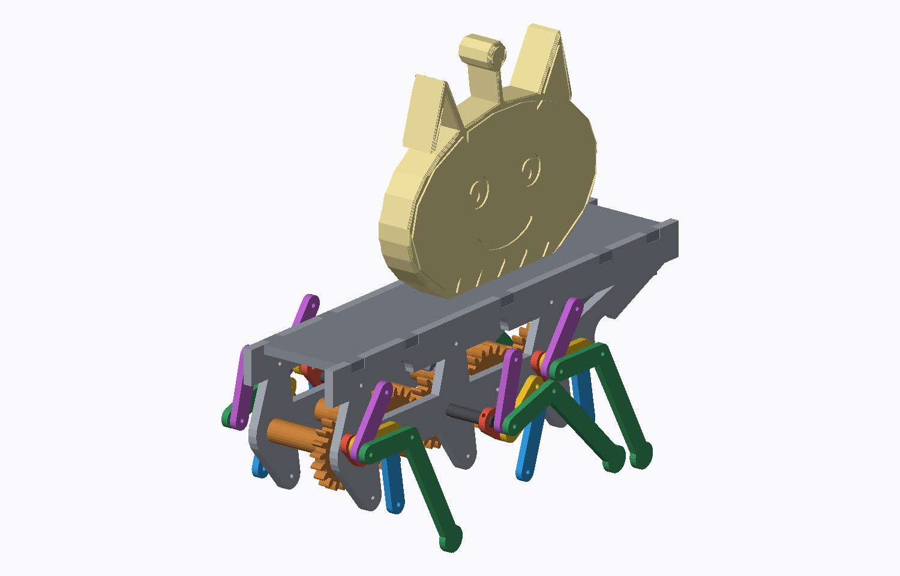
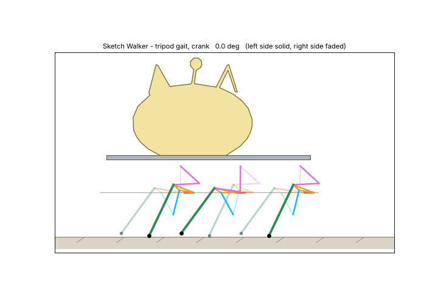

# 01 · Sketch Walker — 낙서가 종이 밖으로 걸어 나온다

Make It Real 2026 출품작 1/10 · Bambu Lab P2S (FDM, 256³ mm) · OpenSCAD + Python

내가 손으로 그린 **다리 없는 크리처**를 그대로 몸통으로 삼고, 다리는 6절 링크로 설계해서 6족 보행(삼각 보행)을 하게 만든 작품입니다.
2D 낙서 → 3D 몸통(그림의 선이 음각으로 남음), 그리고 "그림이 걷는다"는 아이디어 → 실제 보행 기구.




> **상태: 설계·시뮬레이션·CAD 검증 완료 / 실물 출력 미검증.**
> 미리보기의 크리처는 **임시 합성 그림**입니다. 본인 낙서로 교체해야 합니다(아래 0단계).

---

## 작업 순서 (이 순서대로 하세요)

| 단계 | 할 일 | 파일 | 소요 |
|---|---|---|---|
| 0 | 본인 낙서를 그리고 찍어서 몸통 윤곽 생성 | `design/sketch_to_svg.py` | 20분 |
| 1 | **공차 시험판** 출력 → 클리어런스 3개 확정 | `out/00_calibration_coupon.stl` | 12분 출력 |
| 2 | **다리 1개 시험 리그** 출력·조립 → 손으로 돌려 발 궤적 확인 | `out/01_leg_test_rig.stl` | 약 2시간 |
| 3 | 본 출력 (6개 작업) | `out/print_*.stl` | 아래 표 |
| 4 | 조립 → 모터 없이 손으로 먼저 → 모터 연결 | 아래 조립 절 | 2~3시간 |
| 5 | 무게중심·보행 시험, 촬영 | | |

### 0단계. 낙서 → 몸통
1. **그림 규칙**: 흰 종이에 **굵은 검정 펜**(2~3mm), **옆모습**, **다리는 그리지 않기**(다리는 링크가 대신함), **배는 대충 평평하게**.
   윤곽은 **끊기지 않게 닫힌 선**으로 그리세요. 눈·입·무늬는 윤곽 안쪽에 그립니다.
2. 밝은 곳에서 위에서 수직으로 촬영합니다.
3. 실행:
   ```bash
   cd makeitreal/01-sketch-walker/design
   pip install -r requirements.txt
   python3 sketch_to_svg.py my_drawing.jpg body.svg --width 120 --fill --engrave
   cp body_outline.scad ../scad/body_outline.scad
   ```
   `--fill`은 닫힌 윤곽 안을 채우고, `--engrave`는 윤곽 안쪽의 펜 선(눈·입)을 몸통 양면에 0.8mm 음각으로 새깁니다(뒷면은 거울상).
   안 잡히면 `--thresh 140`처럼 임계값을 주고, 펜 틈이 있으면 `--close 15`로 키웁니다.
4. `scad/walker.scad`의 `body_x0`를 `python3 design/mass_com.py`가 알려주는 값으로 맞추고 `build.sh`를 다시 실행합니다.
   몸통 폭이 120mm와 많이 다르면 `body_pegs`(몸통 바닥 핀 위치)가 그림 안에 들어가는지 확인하세요.

### 1단계. 공차 시험판 (가장 먼저)
`out/00_calibration_coupon.stl`을 출력해서 아래 3개를 정하고 `scad/walker.scad` 맨 위 값을 고칩니다.
- 핀 구멍: 1.75mm 필라멘트 토막이 **걸림 없이, 덜걱임 없이** 도는 구멍 → `pin_hole`(기본 2.00), 압입 구멍 → `fix_hole`(기본 1.80)
- D홈: 샤프트 모형이 **손으로 밀어 넣을 정도**로 들어가는 칸 → `d_clear`(기본 0.15)
- 기어: 맞물림이 가장 부드러운 중심거리 → 백래시 `gear_bl`(기본 0.20)
- 모터: **본인 N20 모터를 실측**해서 `motor_w, motor_h, motor_len`, 배터리 홀더를 실측해서 `batt_l, batt_w, batt_h`를 고칩니다.

### 2단계. 다리 1개 시험 리그
`out/01_leg_test_rig.stl` (플레이트+손잡이+링크 5종) + `shaft_end`(리그에 포함됨).
핀 길이(BOM 표의 "front+rear legs" 줄): A 9.2 · B 9.2 · C 13.4 · E 9.2 · O4 18.6 · O6 18.6 mm.
샤프트를 손으로 돌렸을 때 **발이 "D"자로 움직이고 평평한 구간이 아래쪽에 있어야** 합니다. 걸리면 공차를 다시 보세요.
여기서 막히면 본 출력 전에 링크 치수 문제인지 공차 문제인지 판단할 수 있습니다.

### 3단계. 본 출력 (Bambu Studio, P2S)

| 파일 | 내용 | 방향 | 권장 |
|---|---|---|---|
| `print_links.stl` | 크랭크 6(S0×3, S1×3) · 커플러 6 · 로커 6 · E링크 6 | 납작 | 0.16mm, 벽 3, 채움 100%(얇음) |
| `print_feet.stl` | 발 링크 6 | 납작 | 위와 동일 |
| `print_drive.stl` | 기어 3 · 아이들러 2 · 피니언 · 샤프트 3 | 기어는 허브가 위로, 샤프트는 D면이 아래 | 0.16mm, 벽 4 |
| `print_plates.stl` | 측판 2 | 납작 | 0.20mm, 벽 3, 채움 25% |
| `print_deck.stl` | 덱(모터 크래들·배터리 포켓 포함) | 이미 뒤집혀 있음 | 0.20mm, 벽 3 |
| `print_body.stl` | 크리처 몸통 | 눕힘 | 0.20mm, 벽 2, 채움 5~8%, **음각 선에서 필라멘트 교체(M600)** 가능 |

공통(권장, 미검증): PLA 또는 PETG, 노즐 0.4, 서포트 없음, 아이로닝·퍼지 스킨 끄기, 첫 레이어 코끼리발 보정 확인.
링크는 **PLA** 권장(치수 안정), 측판·덱은 PETG도 가능. P2S 베드 256³에 모두 들어갑니다(`check_stl.py`로 확인).

---

## BOM (부품표)

| 항목 | 수량 | 비고 |
|---|---|---|
| N20 기어드 모터, **3mm D축** | 1 | 권장: 작동전압에서 **정격 60~100 rpm, 토크 ≥ 1.5 kg·cm** (피니언 10T:20T로 2배 감속 → 크랭크 30~50 rpm, 보행속도 ≈ 30~50 mm/s) |
| AAA×2 배터리 홀더(스위치 포함) | 1 | 58×31×15mm 가정. 다르면 `batt_*` 수정 |
| AAA 전지 | 2 | |
| 1.75mm 필라멘트 토막 | 약 0.7 m | 힌지 핀 36 + 아이들러 2 + 세트핀 6. 길이표는 `python3 design/bom.py` |
| 순간접착제, 납땜인두(핀 머리 성형), 2.0mm 드릴날(구멍 다듬기) | | |
| 선택: 발바닥 고무(Ø10 접착식 범퍼) | 6 | 미끄러지면 패드 바닥에 부착 |

핀 길이(1.0mm씩 여유 포함, 나머지 머리를 열로 눌러 성형):

| 다리 | 핀 | 개수 | 길이 mm |
|---|---|---|---|
| 앞·뒤 | A 크랭크–커플러 / B 커플러–로커 / E 발–E링크 | 각 4 | 9.2 |
| 앞·뒤 | C 커플러–발 | 4 | 13.4 |
| 앞·뒤 | O4 로커–측판 / O6 E링크–측판 | 각 4 | 18.6 |
| 중간 | A, B, E | 각 2 | 9.2 |
| 중간 | C | 2 | 13.4 |
| 중간 | O4, O6 | 각 2 | 35.4 |
| 아이들러 축 | | 2 | 46.0 |
| 크랭크 세트핀 | 허브→샤프트 | 6 | 9 |

---

## 조립

**위상 규칙(가장 중요)**: 삼각 보행이 되려면 중간 샤프트가 앞·뒤 샤프트보다 정확히 180° 돌아가 있어야 합니다.
샤프트 기어 3개는 **같은 부품**이고 20T는 반 바퀴가 정확히 10이빨이라, 그냥 **중간 샤프트를 통째로(샤프트+기어+양쪽 크랭크) 반대로 꽂으면** 됩니다.
- 앞·뒤 샤프트: D면이 **앞(+x)** 을 향하게
- 중간 샤프트: D면이 **뒤(−x)** 를 향하게
- 크랭크: **왼쪽은 전부 `S0`, 오른쪽은 전부 `S1`** 라벨(= 좌우 다리가 180° 어긋남)
- 아이들러는 5개 기어가 걸림 없이 돌아가면 위상이 맞는 겁니다.

1. 기어열: 샤프트에 기어를 끼우고(허브는 −y(오른쪽) 방향, 기어 판은 +y(왼쪽) 측판 쪽에 붙음), 아이들러를 46mm 핀에 끼웁니다. 모터는 반대편(−y, 오른쪽) 공간에 들어갑니다.
2. 두 측판을 샤프트·아이들러 핀에 끼웁니다(기어 허브가 판 간격 36mm를 잡아줍니다). 아이들러 핀 양끝을 열로 눌러 머리를 만듭니다.
3. 측판의 O4·O6 구멍에 핀을 안쪽에서 넣고 **안쪽 머리를 먼저 성형**한 뒤 다리를 겁니다.
4. 다리(한 쪽에 3개): 안쪽 층부터 — 크랭크(층0) → 커플러(층1, 핀 A) → 로커·E링크(층2, 핀 B, O4/O6) → 발 링크(층3, 핀 C, E). 각 핀은 양끝을 눌러 머리를 만들되 **머리 높이 ≤ 1mm**(층 간격 1.2mm).
   중간 다리는 같은 순서지만 층 번호가 +4 입니다(= 바깥쪽 4층).
5. 크랭크를 샤프트 끝 면에 맞추고 **세트핀**(9mm 필라멘트)을 허브 옆구멍에서 샤프트 구멍까지 밀어 넣고 순간접착제로 고정합니다.
6. 덱에 모터를 끼우고(피니언을 모터축에 먼저 압입), 덱을 위에서 측판 노치에 내려 앉히며 피니언을 중간 기어에 맞물립니다. 탭은 접착.
7. 배터리 홀더를 포켓에 끼우고, 몸통을 덱 위 구멍에 핀으로 꽂습니다.

**회전 방향**: 크리처 오른쪽 옆면에서(머리가 오른쪽) 볼 때 샤프트가 **반시계방향**으로 돌아야 앞으로 걷습니다. 뒤로 걸으면 모터 선을 바꿔 꽂으세요.

**전원을 넣기 전에 반드시 손으로 샤프트를 한 바퀴 돌려보세요.** 걸림이 있으면 어느 층에서 걸리는지 찾고, 공차를 올립니다.

---

## 설계 값 (모두 `scad/walker_params.scad`, 크랭크 a = 9 mm)

| 항목 | 값 |
|---|---|
| 한 바퀴당 몸통 전진 | 60.2 mm (보폭 35.5 mm) |
| 지면 접촉 비율(duty) | 0.62 |
| 발 들림 높이 | 14.3 mm (보폭의 37%) |
| 최소 전달각 | 36° |
| 지면은 크랭크 축 아래 | 44.0 mm (+ 패드 반지름 5.5 mm) |
| 기어 | 인볼루트 20T, 모듈 1.5, 압력각 20°, 중심거리 30 mm |
| 링크 두께 / 폭 / 층 간격 | 3.0 / 8.0 / 1.2 mm |
| 전체 폭(발 포함) | 111 mm (중간 다리 발 기준), 앞·뒤 다리 발 간격 77.6 mm |

---

## 검증 현황 (정직하게)

### 검증됨 (수치로 확인)
| 항목 | 결과 | 도구 |
|---|---|---|
| 링크 합성 | 4절 링크 단독으로는 "발이 가장 아래 + 긴 평지 구간"이 불가능(최대 duty 0.34)했고, 6절 링크로 duty 0.62·리프트 37%·전달각 36° 달성 | `linkage_opt.py`, `linkage6.py`, `refine6.py` |
| SCAD ↔ Python 기구학 | 5개 각도에서 모든 관절 좌표가 소수점 3자리 일치 | `walker.scad`의 `leg_pose` |
| 링크끼리 충돌 | 5개 링크 × 4개 층, 전 구간 0건. 다리 간격 S ≥ 54mm에서 충돌 0, 채택값 60mm | `layout_check.py`, `walker_layout.py` |
| 3D 간섭 | 부품 쌍 20개(고정부끼리, 다리·샤프트·기어·모터·배터리·몸통 대 다리)를 5개 크랭크 각도에서 불리언 교집합 = **0 mm³**. 검사 중 샤프트 돌출·기어 위상 모델링 오류를 발견해 수정함. 다리끼리의 3D 간섭은 2D 층 검사로만 확인 | `tests/interference.scad` |
| 보행 | 지면을 딛는 발 **항상 3개 이상**, 동시에 딛는 발 사이 미끄러짐 ≤ 0.024mm/0.5°, 몸통 높이 출렁임 1.5mm | `walk_sim.py` |
| 안정성 | 무게중심 x = −41 mm(중간 크랭크 축 기준), 지지 다각형 안에 머무는 구간 −68~−23 mm 안(질량 약 225 g 가정, 최적점 −45 mm) | `stability.py`, `mass_com.py` |
| 기어 | 맞물림 겹침 면적 0.0 mm² | OpenSCAD 교집합 |
| 모델 | 8개 STL 모두 비다양체 모서리 0, P2S 베드 256³ 안 | `check_stl.py` |
| 중력 토크 | 마찰 제외 최대 7.6 N·mm | `torque_est.py` |

### 검증되지 않음 — 실물에서 확인해야 함
- **실제 출력 공차**: 핀 구멍·D홈·기어 백래시는 시험판으로 정해야 합니다(기본값은 추정).
- **마찰**: 핀 관절 36개 + 기어 5개의 마찰은 계산하지 않았습니다. 중력 토크(0.08 kg·cm)는 사실상 무시할 수 있어서, 모터 선정(≥ 1.5 kg·cm)은 **경험칙**입니다. 시험 리그를 손으로 돌려 보고 판단하세요.
- **N20 모터·배터리 홀더 치수**: 흔한 값(12×10×25mm, 58×31×15mm)으로 가정했습니다. 반드시 실측하세요.
- **실제 보행**: 발바닥 마찰, 바닥 재질, 질량 분포(infill 가정)에 따라 달라집니다. 미끄러지면 패드에 고무를 붙이세요.
- **세트핀·핀 머리 성형**의 작업성, 몸통 핀과 덱 구멍의 위치 맞춤.
- **본인 그림 → 몸통 변환 품질**: 합성 그림으로만 시험했습니다.
- 질량·무게중심은 채움률 가정값 기반 추정치입니다. 완성 후 저울과 손가락 균형 시험으로 확인하세요.

---

## 독창성 기록 (공모전 설명용)

- 다리 링크는 기존 STL·치수를 쓰지 않고 **미분진화 최적화로 직접 합성**했습니다(`design/`의 코드가 증거).
  4절 링크 탐색은 체비쇼프·호켄 계열로 수렴했고 위 이유로 폐기, **6절 링크**(크랭크-로커 4절 + 발을 구동하는 2링크 다이어드)로 확장했습니다.
- 기어(인볼루트), 몸통 윤곽 변환기, 층 배정·충돌 검사기, 간섭 시험, 안정성 해석을 모두 직접 작성했습니다.
- 몸통은 **내 낙서 사진**에서 자동 생성됩니다(공모전 "2D image → 3D" 요건: 원본 그림을 첫 사진에 함께 올릴 것).

## 폴더
```
scad/     walker.scad(전체 모델) · walker_params.scad(최적화 결과, 자동생성) · tolerance_coupon.scad · body_outline.scad(임시 크리처)
design/   링크 합성(linkage*.py, refine6*.py) · 검사(layout_check, walker_layout, stability, mass_com, torque_est, walk_sim, check_stl)
          · 변환(sketch_to_svg) · 출력물 BOM(bom.py) · 미리보기(make_previews.sh, render_stl.py)
tests/    3D 간섭 시험(interference.scad, run_interference_fast.sh)
out/      STL(바로 슬라이싱) · 미리보기 PNG · 보행 GIF
build.sh  전체 STL 재생성 (OpenSCAD ≥ 2021.01)
```
탐색 과정의 스크립트(`run_opt.py`, `sweep*.py`, `plot_path.py`)는 4절 링크 시도 기록입니다.

## 다시 만들기
```bash
sudo apt install openscad && pip install -r design/requirements.txt
cd design && python3 gen_params.py                      # 링크 치수 → scad/walker_params.scad (a=9)
cd .. && ./build.sh                                      # 모든 STL + 시험판
python3 design/check_stl.py out/*.stl                    # 베드 적합·메시 검사
design/make_previews.sh 40                               # 미리보기 PNG
tests/run_interference_fast.sh                           # 3D 간섭 시험 (수 분)
```
