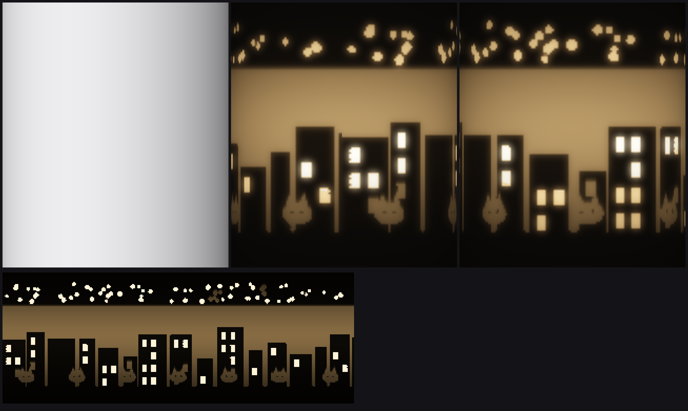

# 02 · Hidden Doodle Lantern — 낮엔 하얀 원통, 불을 켜면 낙서가 떠오른다

Make It Real 2026 · Bambu Lab P2S (FDM) · **출력 1번 + 뚜껑, 조립·전자부품·핀·지지대 없음**

그림을 **벽 두께**로 바꿔서 원통 속에 숨겼습니다. 겉면은 매끈한 하얀 원통이라 낮에는 그림이 안 보이고,
안에 LED 티라이트를 켜면 두꺼운 곳(잉크)은 어둡고 얇은 곳(종이)은 빛나고, 작은 구멍(별·창문)은 점으로 반짝입니다.
주제와의 연결: **2D 그림이 3D 물체의 두께 속에 숨어 있다.**


*(왼쪽 낮 · 가운데/오른쪽 밤 · 아래 펼친 그림. 계산으로 예측한 그림이며 실제 사진이 아닙니다. 그림은 제가 만든 **임시 그림**입니다.)*

---

## 만드는 순서 (당신이 할 일은 5단계뿐)

| 단계 | 할 일 | 파일 | 시간 |
|---|---|---|---|
| 0 | (선택) 본인 그림 그리기 → 변환 | `design/lantern.py` | 20분 |
| 1 | **시험 키트** 출력 → 빛 투과·뚜껑 끼임·구멍 크기 확인 | `out/testkit.stl` | 15분 |
| 2 | 랜턴 출력 | `out/lantern.3mf` (또는 `.stl`) | 약 5~6시간 |
| 3 | 뚜껑 + 받침 출력 | `out/lid.stl`, `out/riser.stl` | 1시간 + 30분 |
| 4 | 받침 위에 LED 티라이트 올리고 랜턴을 씌우기, 뚜껑 닫기 | | 1분 |

**지금 바로 쓸 수 있습니다.** 0단계를 건너뛰면 임시 그림(별·스카이라인·창문·고양이 낙서)이 그대로 출력됩니다.
본인 그림으로 바꾸고 싶을 때만 0단계를 하세요.

### 0단계. 내 그림으로 바꾸기
1. 흰 종이를 **가로 297mm × 세로 100mm** 정도의 긴 띠로 자르고(A4를 가로로 놓고 세로 100mm 만큼), **굵은 검정 펜**으로 그립니다.
   이 띠가 원통을 한 바퀴 감쌉니다(둘레 267mm). 왼쪽 끝과 오른쪽 끝이 이어지니 양 끝은 비우거나 비슷하게 맞추세요.
2. 규칙 3개
   - **검정 = 어두움, 흰색 = 빛남.** 선은 **2.5mm 이상 굵게**(가는 선은 사라집니다).
   - 검정으로 둘러싸인 **작은 흰 점/네모(지름 2~8mm)** 는 **진짜 구멍**이 됩니다 → 별, 창문, 눈동자.
   - 큰 흰 면은 은은하게 빛나는 면이 됩니다.
3. 위에서 수직으로 밝게 촬영(또는 스캔)한 뒤:
   ```bash
   cd makeitreal/02-hidden-doodle-lantern/design
   pip install -r requirements.txt
   python3 lantern.py my_strip.jpg --name mine        # out/mine.3mf / mine.stl 생성
   python3 preview.py mine                            # 낮/밤 예상 그림(out/preview_lantern.png)
   ```
   - 비율이 안 맞으면 `--fit contain`(잘리지 않게 여백 추가).
   - 필라멘트가 너무 투명해서 흰 부분이 눈부시면 `--skin-steps 2`(벽 1.6mm).
   - 변환기는 **45° 규칙을 위반하면 스스로 멈춥니다**(지지대 없이 출력되도록 보장).

### 1단계. 시험 키트 (15분, 꼭 먼저)
`out/testkit.stl` 하나에 세 가지가 들어 있습니다.
- **두께 계단** 0.8 / 1.6 / 2.4 / 3.2mm: LED 앞에 대 보세요. 0.8이 너무 눈부시면 `--skin-steps 2`, 3.2에서 빛이 많이 새면 `T_INK`를 올려야 합니다(말해 주세요).
- **뚜껑 시험 링크**: 랜턴 윗부분 6mm 조각입니다. 뚜껑 플러그가 **손으로 밀어 넣을 만큼** 들어가면 합격. 꽉 끼면 `parts.scad`의 `LID_CLEAR`를 0.45로, 헐거우면 0.25로.
- **구멍 게이지** 2/3/4/6mm: 열려 있는 가장 작은 구멍이 별로 쓸 수 있는 최소 크기입니다.

### 2~3단계. 슬라이서 설정 (Bambu Studio, P2S — 제안값, 제가 출력해 보지는 못했습니다)
| 항목 | 값 |
|---|---|
| 필라멘트 | **흰색 PLA**(가장 중요. 회색·검정은 안 빛남) |
| 노즐/레이어 | 0.4 / 0.20 mm |
| 벽(Wall loops) | **8** (3.2mm 두꺼운 벽이 속까지 차야 빛이 안 샙니다) |
| 윗/아랫면 | 4층 · 채움은 어차피 거의 없음 |
| 서포트 | **끄기** |
| 브림 | 5mm 권장 (지름 85mm × 높이 100mm 원통이 안 쓰러지게) |
| 아이로닝/퍼지 스킨 | 끄기 |
| 바깥벽 속도 | 80~100 mm/s (겉면이 매끈해야 낮에 깨끗합니다) |

뚜껑은 **그대로 놓으면** 플러그 쪽이 베드에 닿습니다(서포트 필요 없음). 받침(riser)은 세워서 출력합니다.

### 4단계. 사용
- 받침을 바닥에 놓고, 그 위에 **LED(무불꽃) 티라이트**를 올린 다음 랜턴을 씌우고 뚜껑을 닫습니다.
- ⚠ **진짜 촛불은 금지**(PLA가 녹습니다).
- 뚜껑의 작은 구멍 8개는 천장에 점 8개로 비칩니다.

---

## 설계 값
| 항목 | 값 |
|---|---|
| 크기 | 지름 85 × 높이 100 mm (P2S 베드 256 안) |
| 벽 두께 | 어둠 3.2 mm / 빛남 0.8 mm / 구멍(별·창문) 0 mm |
| 그림 해상도 | 0.8 mm 격자, 둘레 334칸 × 높이 125칸 (그림 영역 높이 약 90mm) |
| 오버행 | **정확히 45°** 이내(두꺼워지는 곳은 한 칸에 0.8mm씩 계단 → 지지대 없음), 구멍 위는 브리징(구멍 ≤ 8mm) |
| 뚜껑 | 플러그 반지름 38.95 / 랜턴 안쪽 39.30 → 간극 0.35 mm |

## 검증 현황 (정직하게)
**검증됨(수치)**
- 메시가 **완전히 닫힘**: 모든 모서리가 정확히 삼각형 2개에 공유됨, 방향 일관(`lantern.py`가 직접 검사 + 별도 도구 `check_stl.py`가 독립 검사: 비다양체 모서리 0).
- 최대 오버행 45.0° (변환기가 위반 시 중단).
- STL과 3MF의 삼각형 수 일치, 치수·뚜껑 간극 `check_consistency.py`로 확인.
- 낮/밤 모습은 단순 모델(흰 PLA 빛 감쇠 + LED 위치)로 예측.

**검증되지 않음 — 실물에서 확인**
- 실제 **빛 투과량**(예측은 감쇠 길이 0.9mm 가정), LED 밝기·색.
- 0.8mm 얇은 벽과 45° 계단이 P2S에서 깨끗이 출력되는지, 구멍 2mm가 막히지 않는지, 뚜껑 끼임 — **시험 키트로 확인**하세요.
- 출력 시간·무게(솔리드 부피 57cm³ → 대략 70g, 5~6시간 추정).
- 임시 그림은 합성이라 실제 손그림 변환 품질은 아직 못 봤습니다.

## 폴더
```
design/lantern.py      그림 → 벽 두께 → 닫힌 메시(STL/3MF)   design/preview.py  낮/밤 예측 그림
design/check_*.py      독립 검사                              scad/parts.scad    뚜껑·받침·시험 키트(OpenSCAD)
out/                   바로 슬라이싱할 파일 + 미리보기
```
